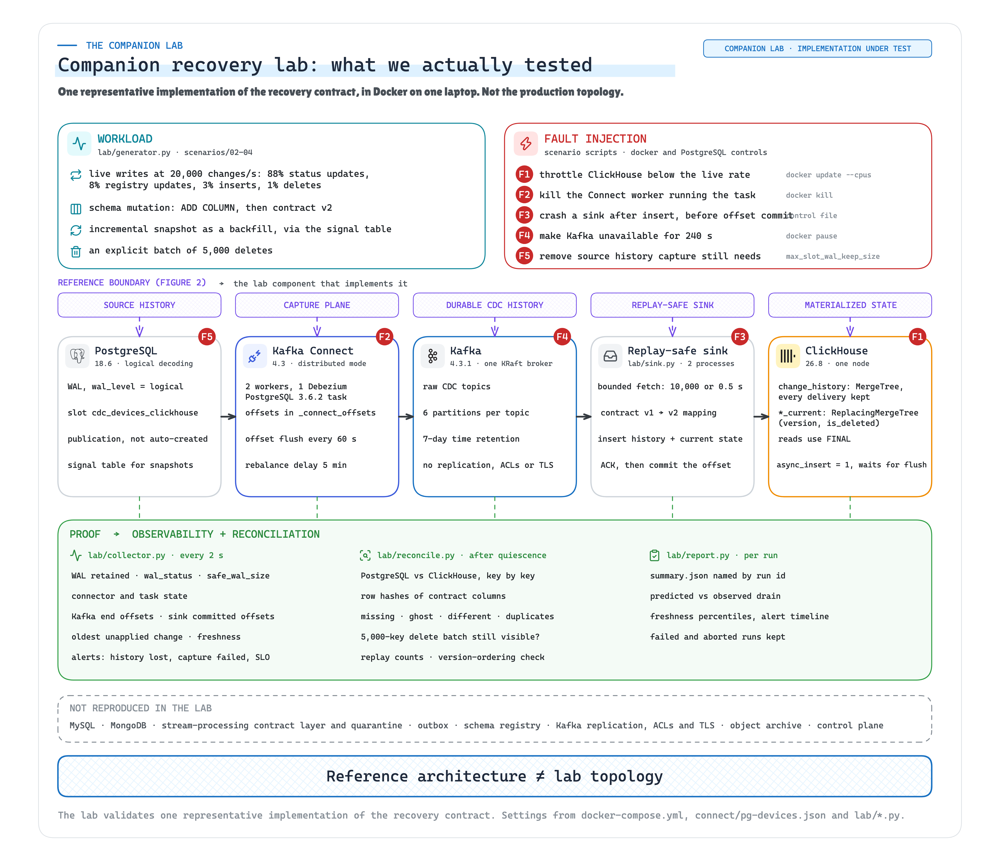
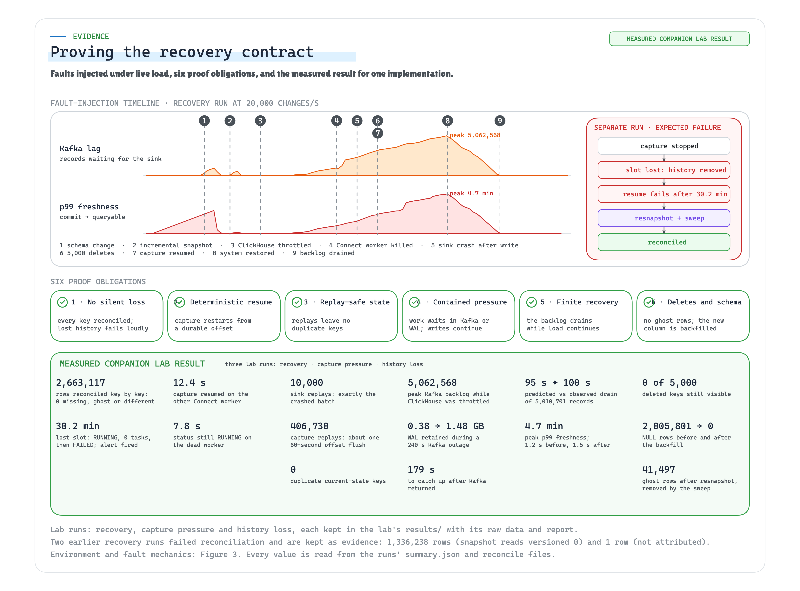
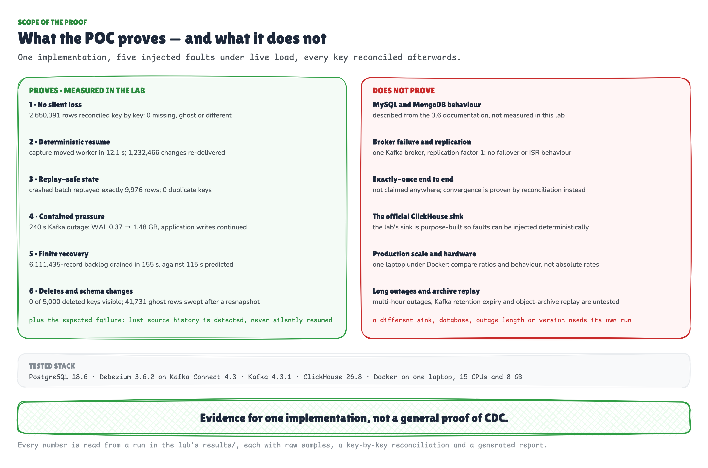

# CDC failure-recovery lab

Companion lab for the article **CDC Is Not a Pipe** ([link to the Medium post when published](https://github.com/ereshzealous/blog-companions#demos)).

## What this is

A fault-injection lab that tests one change data capture (CDC) implementation against a recovery contract:

> For every durable boundary, we know where unprocessed data waits, what durable position recovery resumes from, what can replay, and how downstream state converges back to correctness.

The data path is PostgreSQL → Debezium on Kafka Connect → Kafka → a replay-safe sink → ClickHouse, all in Docker on one machine. Scripts drive live load through it, inject faults at each boundary, and then compare PostgreSQL with ClickHouse key by key. Every number is written to `results/<run-id>/` by the lab itself.

It is evidence for **this implementation**, at the versions, rates and limits recorded in each run. It is not proof that CDC, Debezium, Kafka or ClickHouse is reliable in general. A different sink, database, outage length or version needs its own run.

The data is synthetic operational device data: registrations, status, firmware. No personal or clinical data.

## Run the POC

Everything runs from this directory. Three commands:

```bash
./scripts/init-env.sh      # 1. write .env: pinned image versions and local-only passwords   (seconds)
./scripts/run-all.sh       # 2. all four scenarios, verified, with the pages built          (~2.5 hours)
open results/index.html    # 3. look at what happened
```

`run-all.sh` is the whole POC end to end. It measures capacity with no faults, runs the recovery test using
the sink capacity it just measured, runs the Kafka outage, runs the expected failure where the replication
slot loses the history capture needs, tears the lab down, checks every run against its scenario's pass
criteria, and writes one page per run plus an index.

You need Docker with Compose v2, at least 8 GB for the Docker VM, and `bash`, `python3` and `openssl` on the
host. Nothing else should be running on that Docker VM while it measures, because other containers change the
rates. Progress is written to `results/run-all-<UTC>.log` as well as the terminal.

**Less than two hours?** Run one scenario. Each starts from a destroyed environment, so they are independent:

```bash
./scenarios/01-capacity.sh                             # ~20 min · no faults; measures mu, the sink's capacity
LAMBDA=20000 MU=<mu> ./scenarios/02-recovery-test.sh   # ~25 min · every fault, under live load
LAMBDA=20000 ./scenarios/03-capture-pressure.sh        # ~15 min · Kafka unavailable for 240 s
LAMBDA=20000 ./scenarios/04-history-loss.sh            # ~40 min · the expected failure
```

**No Docker at all?** The recorded runs are in the repository. Both of these work offline, with no
dependencies beyond `python3`:

```bash
./scripts/verify-run.py --published   # the pass criteria of each published run, PASS or FAIL per check
./scripts/build-report.py             # results/index.html and a report.html for every run
```

**Something went wrong mid-run?** `run-all.sh` takes a second argument and restarts at that scenario, reusing
the capacity run's measurement instead of repeating it:

```bash
./scripts/run-all.sh 20000 recovery        # skip capacity, start at the recovery test
```

### What a POC run gives you

- `results/index.html` — every run with its verdict; each card opens that run's page
- `results/<run-id>/report.html` — the verdict and its checks, the fault timeline, four charts from the
  collector's two-second samples, the reconciliation counts, the alerts
- `results/<run-id>/report.md` — the same run in text
- `results/<run-id>/summary.json` — the machine-readable result: findings, reconciliations, alerts, timeline,
  versions and the metric series
- the raw files behind all of it: `metrics.jsonl`, `events.jsonl`, `alerts.jsonl`, `generator.jsonl`,
  `sink-<id>.jsonl`, `reconcile-<label>.json`, `versions.json`

## Contents

1. [Run the POC](#run-the-poc)
2. [Architecture](#architecture)
3. [Repository layout](#repository-layout)
4. [Prerequisites](#prerequisites)
5. [Quick start: bring the lab up](#quick-start-bring-the-lab-up)
6. [Run the scenarios](#run-the-scenarios)
7. [Validate a run](#validate-a-run)
8. [Inspect a running lab](#inspect-a-running-lab)
9. [Configuration](#configuration)
10. [Troubleshooting](#troubleshooting)
11. [Stop and clean up](#stop-and-clean-up)
12. [How it works](#how-it-works)
13. [Published results](#published-results)
14. [What this does not show](#what-this-does-not-show)
15. [Hardening and per-source rules](#hardening-and-per-source-rules)
16. [Security notes](#security-notes)

## Architecture

- **PostgreSQL 18.6** with `wal_level=logical`, a publication owned by the database (not auto-created), and three least-privilege roles:
  - `device_app` for application DML on the device tables, plus `INSERT` on the signal table
  - `cdc_capture` with `LOGIN` and `REPLICATION`, `SELECT` on the captured tables, and `SELECT`, `INSERT` and `DELETE` on the signal table for incremental-snapshot watermarks; not a superuser
  - `cdc_monitor` with `pg_monitor`, for slot and WAL visibility only

  The seed is 2,000,000 device-registry rows and 500,000 device-status rows.
- **Debezium 3.6.2** PostgreSQL connector (`pgoutput`, one slot `cdc_devices_clickhouse`, source signaling) on **two Kafka Connect 4.3 workers** in distributed mode. The capture password reaches the connector through Kafka's `EnvVarConfigProvider`; the connector JSON contains `${env:CDC_CAPTURE_PASSWORD}`, never a secret.
- **Apache Kafka 4.3.1** in KRaft mode: one broker, raw CDC topics with six partitions and seven days of time retention.
- **Two sink processes** in one consumer group ([`lab/sink.py`](lab/sink.py)).
- **ClickHouse 26.8** with an append-only `change_history` table and `ReplacingMergeTree(version, is_deleted)` current-state tables.
- **A load generator** ([`lab/generator.py`](lab/generator.py)) that commits a target rate of row changes: 88% status updates, 8% registry updates, 3% inserts, 1% deletes.
- **A collector** ([`lab/collector.py`](lab/collector.py)) that samples every boundary on one clock every two seconds and raises alerts.
- **A reconciliation harness** ([`lab/reconcile.py`](lab/reconcile.py)) and **a report generator** ([`lab/report.py`](lab/report.py)).

No service publishes a port to the host. Everything is reached through `docker compose exec`.



The figure maps each component to the boundary it implements in the article's reference architecture.

## Repository layout

```text
cdc-failure-recovery-lab/
├── docker-compose.yml          all services, memory limits, Connect worker settings
├── scripts/init-env.sh         writes .env: image versions, tunables, random local credentials
├── postgres/init/              schema, seed data, roles, publication, signal table
├── clickhouse/init/            history and current-state tables, the cdc_sink user
├── clickhouse/config.d/        low-memory server settings
├── clickhouse/users.d/         low-memory user settings
├── connect/pg-devices.json     Debezium connector configuration (no secrets)
├── lab/                        Python tools image: sink, generator, collector, reconcile, report, connectctl
├── scenarios/
│   ├── lib.sh                  shared helpers used by every scenario
│   ├── 00-up.sh                fresh environment: reset, start, register connector, initial snapshot
│   ├── 01-capacity.sh          measure capture and sink capacity
│   ├── 02-recovery-test.sh     the recovery test under live load
│   ├── 03-capture-pressure.sh  Kafka outage while the application keeps writing
│   └── 04-history-loss.sh      expected failure: source history removed
├── control/                    runtime control files (git-ignored)
└── results/                    one directory per run, committed as evidence
```

## Prerequisites

- **Docker** with Compose v2. The published runs used Docker Desktop on macOS with Docker Compose v5.1.1.
- **Docker resources:**
  - At least **8 GB of memory** for the Docker VM. The container memory limits add up to about 6.8 GB.
  - As many CPUs as you can give it. The published runs used 15.
  - Allow roughly 10 GB of free disk for images and volumes.
- **Host tools:** `bash`, `python3` (standard library only), `openssl`.
- **Nothing else sharing the Docker VM** while you measure. Other containers change the rates.

## Quick start: bring the lab up

Run everything from the `cdc-failure-recovery-lab/` directory.

**1. Generate the environment file.**

```bash
./scripts/init-env.sh
```

This writes `.env` with pinned image versions, lab tunables and random local-only passwords. `.env` is git-ignored. If it already exists, the script leaves it alone.

**2. Start a fresh environment.**

```bash
./scenarios/00-up.sh smoke
```

This takes about 5 minutes, longer on the first run while images download and the tools image builds. The script:

- destroys any previous lab containers and volumes
- starts PostgreSQL, Kafka and ClickHouse and waits until they are healthy
- starts the Connect workers one at a time
- registers the Debezium connector
- starts the two sink processes
- waits until ClickHouse holds every seeded row

It creates `results/smoke-<UTC start time>/` with `versions.json` and `events.jsonl`, and ends with `initial-load-complete`.

**3. Check that it is healthy.**

```bash
docker compose ps
docker compose exec tools python connectctl.py status
```

Every service should be `Up`, with PostgreSQL, Kafka and ClickHouse `healthy`. The connector and its single task should be `RUNNING`.

The lab is now idle: capture is running, and no load is being generated. The scenarios below each start their own fresh environment, so you do not need to keep this one.

## Run the scenarios

Every scenario calls `00-up.sh` first. **Starting a scenario destroys the previous environment's containers and volumes.** The `results/` directory is kept.

Each run writes `results/<scenario>-<UTC start time>/`, for example `results/recovery-20260913T212902Z/`. Output also streams to the terminal; to keep a copy, append `2>&1 | tee <name>.log`.

Run them in this order, because the recovery test needs the sink capacity measured by the capacity run.

**1. Capacity (about 20 minutes)**

```bash
./scenarios/01-capacity.sh
```

This measures each plane on its own:

- Fill a WAL backlog with the sink stopped, then measure how fast the single capture task drains it into Kafka.
- Repeat the fill and drain with `tasks.max=4`.
- Drain the Kafka backlog with one sink process, then two.

The two-process drain rate is μ, the recovery capacity used by the recovery test.

**2. Recovery test (about 30 minutes)**

```bash
CAPACITY_RUN=$(ls -d results/capacity-* | tail -1)
MU=$(python3 -c "import json, sys; print(round(json.load(open(sys.argv[1]))['findings']['sink_mu_2_processes']))" "$CAPACITY_RUN/summary.json")
LAMBDA=20000 MU=$MU ./scenarios/02-recovery-test.sh
```

`LAMBDA` is the live change rate. Keep it well below `MU`, or the backlog cannot drain. While live changes continue at λ, the script:

1. adds a column to the source table, then adopts contract v2 in ClickHouse
2. runs an incremental snapshot as a backfill
3. throttles ClickHouse until the sink falls behind
4. kills the Connect worker that runs the capture task
5. crashes a sink after its insert and before its offset commit
6. deletes an explicit batch of 5,000 devices
7. restores ClickHouse and records predicted drain time B / (μ − λ) against the observed one
8. stops load and reconciles key by key

**3. Capture pressure (about 15 minutes)**

```bash
LAMBDA=20000 ./scenarios/03-capture-pressure.sh
```

This pauses Kafka for 240 seconds while the application keeps writing. It measures the source write rate, WAL growth and catch-up time, then reconciles.

**4. History loss, the expected failure (about 45 minutes)**

```bash
LAMBDA=20000 ./scenarios/04-history-loss.sh
```

1. Cap `max_slot_wal_keep_size` at 1 GB, stop capture, and keep writing until PostgreSQL marks the slot `lost`.
2. Resume normally and observe for up to 1,900 seconds: connector and task state, Debezium's slot retries, the failure it eventually raises, and the alerts. Debezium 3.6.2 retries for about 30 minutes before failing, so most of this scenario's time is this window.
3. Recover explicitly: reset offsets, drop the lost slot, resnapshot.
4. Reconcile, sweep the rows the resnapshot could not see deleted, and reconcile again.

### Run everything in one command

```bash
scripts/run-all.sh            # capacity, recovery test, capture pressure, history loss, then verify and report
scripts/run-all.sh 30000      # the same at a different change rate
```

Each scenario starts from a destroyed environment, so the four runs are independent. The recovery test uses
the sink capacity the capacity run just measured rather than a guessed number. Progress is written to
`results/run-all-<UTC>.log`. Expect about two and a half hours on a laptop.

## Validate a run

### What a run leaves behind

Run folders are named `<scenario>-<UTC start time>`, so runs of the same scenario sort together and in time order. Runs recorded on 13 September 2026 were renamed from the earlier `<UTC start time>-<scenario>` form; only the identifier changed, not the data.

Each `results/<scenario>-<UTC start time>/` directory contains:

- **`summary.json`:** the machine-readable result. Its keys are `findings`, `reconcile` (one entry per reconciliation), `alerts`, `timeline`, `versions` and a metric `series`.
- **`report.md`:** the same content, readable: findings, a timeline of every event, and each reconciliation.
- **`reconcile-<label>.json`:** full reconciliation output, including sample keys and evidence for any row that differs.
- **`events.jsonl`:** every scenario action with a millisecond timestamp, ending with an OOM check.
- **`metrics.jsonl`:** collector samples every two seconds.
- **`alerts.jsonl`:** alert transitions (`firing`, `resolved`).
- **`generator.jsonl`:** the load generator's achieved rate.
- **`sink-<id>.jsonl`:** per-process sink logs, including batch offsets and crashes.
- **`versions.json`:** software versions, Docker CPUs and memory, host CPU.

`summary.json` and `report.md` are derived from the raw files by `lab/report.py`, which the scenario runs as its last step. No number is typed in by hand.

### Check a run in one command

`scripts/verify-run.py` reads the files a run already wrote and applies that scenario's pass criteria.
It needs no Docker, no network and no Python packages, so a run can be checked long after the lab is gone:

```bash
scripts/verify-run.py --published            # the four runs the article cites
scripts/verify-run.py                        # every run under results/
scripts/verify-run.py results/<run-id>       # one run
```

For the published recovery run it prints:

```text
recovery · recovery-20260913T212902Z
  postgres 18.6 (Debian 18.6-1.pgdg13+2) · clickhouse 26.8.3.105 · kafka_image apache/kafka:4.3.1 · debezium_image quay.io/debezium/connect:3.6.2.Final
  PASS  scenario finished (events.jsonl ends with oom-check)  —  last event: oom-check
  PASS  no container was OOM-killed  —  none
  PASS  reconcile final converged=True  —  converged=True
  PASS  final: device_registry has no missing, ghost, different or duplicate rows  —  source=2150391 all zero
  PASS  final: device_status has no missing, ghost, different or duplicate rows  —  source=500000 all zero
  PASS  no deleted key is still visible downstream  —  5000 keys deleted, 0 still visible
  PASS  the crashed batch replayed, and nothing else  —  crashed batch 9,976 rows, sink replays 9,976
  PASS  the backfill reached every row  —  NULL rows after backfill: 0
  PASS  drain measured (not a pass condition)  —  6,111,435 records, predicted 115 s
  9/9 checks passed
```

Run without arguments and the superseded runs fail, which is the point of keeping them: the first recovery
attempt reports 1,336,238 content mismatches, the second reports 1, and the abandoned runs stop before
their `oom-check`. Exit status is 0 only if every checked run passes.

To read a run yourself rather than have it checked, open its `report.md`, or query `summary.json` directly:

```bash
python3 -c "import json;s=json.load(open('results/<run-id>/summary.json'));print(json.dumps(s['findings'],indent=1))"
```

### See a run, visually

`scripts/build-report.py` turns a run into a page you can look at:

```bash
scripts/build-report.py                      # every run, plus results/index.html
scripts/build-report.py results/<run-id>     # one run
open results/index.html                      # start here
```

`results/index.html` lists every run with its verdict and headline numbers. Each card opens that run's
`report.html`: the verdict and every check behind it, the fault timeline with the minute each fault landed,
four charts drawn from the collector's two-second samples — Kafka lag, p99 freshness, WAL retained by the
slot, sink throughput, each with the faults marked — then the reconciliation counts per table and the alerts.

The page is inline SVG and inline CSS with no network calls, so it opens from disk and can be attached to a
ticket as one file. Nothing on it is typed by hand: every value is read from `summary.json`, `metrics.jsonl`
and `events.jsonl` in the run folder.

### Pass criteria

A run is valid only if its scenario finished, `events.jsonl` ends with an `oom-check`, and no container was OOM-killed. Beyond that, each scenario has its own criteria.

**Capacity**
- `reconcile capacity` is `converged=True`.
- `findings.tasks_running_with_tasks_max_4` is `1`: raising `tasks.max` does not add capture tasks.
- `findings.sink_mu_2_processes` is higher than `findings.sink_mu_1_process`.
- Expected alert: `freshness-slo-breach`, because the sink is stopped on purpose while the backlog builds.

**Recovery test**
- `reconcile final` is `converged=True`, with 0 missing, ghost and different rows and 0 duplicate keys in both tables.
- `delete batch` shows `still_visible_in_clickhouse: 0`.
- `sink_replays` equals `findings.sink_crash.rows_in_crashed_batch`: the crashed batch replayed, and nothing else.
- `findings.schema_backfill.null_after.null_rows` is `0`: the backfill reached every row.
- `findings.drain` records predicted and observed drain seconds. This is a measurement, not a pass condition.
- Expected alert: `freshness-slo-breach` while ClickHouse is throttled.

**Capture pressure**
- `reconcile final` is `converged=True`, with 0 missing, ghost and different rows and 0 duplicate keys.
- The `kafka-paused` and `kafka-unpaused` events record WAL retained by the slot before and after the outage, and `caught-up` records the seconds needed after Kafka returned.
- Alerts may include `freshness-slo-breach` and `capture-failed`. The published run saw the capture task report FAILED for about 4 seconds after Kafka returned.

**History loss.** Here the first reconciliation is supposed to fail.
- `reconcile after-resnapshot` is `converged=False`, with missing 0, different 0 and ghost rows greater than 0. These are rows the source deleted while its history was lost; a resnapshot cannot emit those deletes.
- `reconcile after-sweep` is `converged=True`, with 0 missing, ghost and different rows.
- Alerts include `source-history-lost`. Expect `source-history-unreserved`, `capture-unassigned` and `capture-failed` as well.
- `events.jsonl` contains `source-history-lost`, `normal-resume-requested`, then `normal-resume-refused`, or `normal-resume-still-stalled` if the observation window ran out, then `resnapshot-sweep`.

### When a run does not converge

1. Open `reconcile-<label>.json`. For each table, `samples` lists differing keys and `evidence` holds, for each wrong key, the source row, every ClickHouse version and its change history.
2. Read `events.jsonl` around the fault that preceded the difference.
3. Check `version_ordering` in the same file. It counts keys whose final state would change if history were ordered by source position instead of Kafka offset.
4. Keep the run directory. Failed runs are evidence too; record the cause in the run's `events.jsonl` rather than deleting it.

## Inspect a running lab

These commands are read-only and work while any scenario, or the idle smoke environment, is up.

```bash
# Services and health
docker compose ps

# Connector and task state, and which worker runs the task
docker compose exec tools python connectctl.py status

# Replication slot: activity, WAL status and retained WAL
docker compose exec postgres psql -U lab_admin -d devices -c \
  "SELECT slot_name, active, wal_status, safe_wal_size, pg_size_pretty(pg_current_wal_lsn() - restart_lsn) AS retained_wal FROM pg_replication_slots"

# Live rows in ClickHouse current state
docker compose exec clickhouse sh -c 'clickhouse-client --user lab --password "$CLICKHOUSE_PASSWORD" -q "SELECT count() FROM cdc.device_registry_current FINAL WHERE is_deleted = 0"'

# Latest collector sample for the current run
tail -n 1 "results/$(cat control/run-id)/metrics.jsonl" | python3 -m json.tool

# Alerts as they fire and resolve
docker compose logs -f collector | grep ALERT
```

`connectctl.py` also supports `task-worker`, `offsets`, `stop`, `resume`, `restart`, `reset-offsets`, `delete` and `versions`. The ones that change state are used by the scenarios; avoid running them by hand during a measured run.

The collector raises five alerts:

- **`source-history-unreserved`:** the slot's `wal_status` is `unreserved`.
- **`source-history-lost`:** the slot's `wal_status` is `lost`.
- **`capture-failed`:** the connector or task is `FAILED`.
- **`capture-unassigned`:** the task is `UNASSIGNED`.
- **`freshness-slo-breach`:** the oldest unapplied change is older than `FRESHNESS_SLO_MS`, 60 seconds by default.

## Configuration

### `.env`, written by `scripts/init-env.sh`

- **Image versions:** `POSTGRES_VERSION`, `KAFKA_VERSION`, `DEBEZIUM_VERSION`, `CLICKHOUSE_VERSION`.
- **Seed size:** `SEED_REGISTRY_ROWS` (2,000,000) and `SEED_STATUS_ROWS` (500,000).
- **Connect settings the lab measures:** `CONNECT_OFFSET_FLUSH_INTERVAL_MS` (60000) and `CONNECT_SCHEDULED_REBALANCE_MAX_DELAY_MS` (300000), both Kafka's defaults.
- **Sink batching:** `SINK_BATCH_MAX` (10000) and `SINK_BATCH_WAIT_S` (0.5).
- **Generator:** `GENERATOR_RATE` (20000) and `GENERATOR_WORKERS` (6).
- **Freshness objective:** `FRESHNESS_SLO_MS` (60000).
- **Local-only credentials,** generated at random.

### Scenario variables, set on the command line

- **`01-capacity.sh`:** `FILL_RATE` (150000), `FILL_S` (90), `CAPACITY_WORKERS` (10).
- **`02-recovery-test.sh`:** `LAMBDA` and `MU` are required. Optional: `THROTTLE_S` (600) and `CH_THROTTLE_STEPS` (`"0.5 0.3 0.2 0.12 0.08"`, the ClickHouse CPU limits tried in order until lag grows faster than a quarter of λ).
- **`03-capture-pressure.sh`:** `LAMBDA` is required. Optional: `OUTAGE_S` (240).
- **`04-history-loss.sh`:** `LAMBDA` is required. Optional: `MAX_SLOT_WAL_KEEP_SIZE` (`1GB`) and `RESUME_OBSERVE_S` (1900).

Rates depend on the machine. On a smaller machine, run the capacity scenario first and choose `LAMBDA` well below the measured `sink_mu_2_processes`.

## Troubleshooting

- **A Connect worker exits during startup with `OutOfMemoryError`.** Two JVMs scanning the plugin path at once can exhaust the 448 MB heap. The scripts start workers one at a time and retry a failed start once, recording `connect-worker-start-failed` in `events.jsonl`. If it keeps happening, give Docker more memory.
- **A container was OOM-killed.** The final `oom-check` event names it. Give the Docker VM more memory, and stop other containers sharing it. The published runs' aborted attempts are listed in the run index below.
- **A scenario stops with `timeout after N s`.** Read the last lines of `events.jsonl`, then `docker compose logs --tail 100 connect-1 connect-2 sink collector`.
- **Authentication fails after regenerating `.env`.** PostgreSQL and ClickHouse set passwords only when their volumes are first created. Remove the volumes whenever you regenerate `.env`: `docker compose --profile load down -v`, then `rm .env && ./scripts/init-env.sh`.
- **`.env already exists; delete it to regenerate.`** This is expected. `init-env.sh` never overwrites an existing `.env`.
- **Nothing answers on localhost.** This is by design: no ports are published. Use the `docker compose exec` commands above.
- **Your numbers differ from the published ones.** Compare behaviour and ratios, not absolute throughput. See [What this does not show](#what-this-does-not-show).

## Stop and clean up

```bash
# Stop and remove containers, keep volumes
docker compose --profile load down

# Stop and remove containers and volumes (all lab data)
docker compose --profile load down -v
```

`results/` is never touched by either command. `.env` stays until you delete it.

## How it works

### How the sink stays replay-safe

1. Fetch a bounded batch: up to 10,000 records or 0.5 seconds.
2. Map each Debezium event through a versioned contract. Unknown fields are counted and kept in the history row's `after_json`, not published.
3. Insert current-state rows with `version` set to the record's Kafka offset and `is_deleted` set to 1 for deletes. Insert one history row per delivery with `event_id = table:device_id:position:op`. The position is the PostgreSQL LSN or, for incremental snapshot reads, which carry no LSN, the stream position Debezium records in `source.sequence`.
4. Commit Kafka offsets **only after** ClickHouse has acknowledged every insert.

**Why the offset and not the LSN.** Debezium keys every event by the primary key, so all events for a device land in one partition in the order Debezium emitted them. That order is commit order for changes, and it places each snapshot read correctly against the changes around it. A change's LSN is where it was written, not when its transaction committed, and incremental snapshot reads have none. The offset stays a valid version only while a key's partition never changes. Repartitioning a raw topic, or recreating it, means rebuilding current state.

A crash between steps 3 and 4 replays the batch. Current state absorbs it: the highest version wins, and reads use `FINAL`. History keeps every delivery, so replays are counted, not hidden:

- **sink replays** = deliveries − distinct (table, partition, offset)
- **capture replays** = distinct (table, partition, offset) − distinct `event_id`

### Fault mechanics

- **Sink crash after insert, before commit.** [`scenarios/02-recovery-test.sh`](scenarios/02-recovery-test.sh) creates `control/crash-sink-after-insert`. One sink claims it with an atomic rename, logs the batch's offset ranges, and exits after ClickHouse acknowledges its next insert. Docker restarts it.
- **Connect worker loss.** `docker kill` on the worker that runs the task, with Kafka's default `scheduled.rebalance.max.delay.ms` of five minutes. The dead worker is restarted only after capture is running elsewhere.
- **ClickHouse slowdown.** `docker update --cpus` steps ClickHouse down until Kafka lag grows by more than a quarter of λ, then restores it after ten minutes.
- **Kafka outage.** `docker pause` on the broker.
- **History loss.** `ALTER SYSTEM SET max_slot_wal_keep_size`, then `CHECKPOINT` until `pg_replication_slots.wal_status = 'lost'`.

### Reconciliation

[`lab/reconcile.py`](lab/reconcile.py) waits until Kafka end offsets have been unchanged for 90 seconds and the sink group has no lag. It then hashes every row identically on both sides: the MD5 of the contract columns joined by `|`, keeping the first 48 bits. It compares count and hash sums in 4,096 key buckets and diffs mismatched buckets row by row. It reports:

- missing rows, ghost rows and content mismatches
- logical duplicate keys, which must be 0
- physical extra versions, which are expected until merges run
- sink and capture replays
- whether an explicit delete batch is still visible

Distinct counts over tens of millions of history rows use `GROUP BY` on 128-bit hashes with external aggregation, so a small ClickHouse can compute them.

## Published results



All runs used the same laptop (Apple M5 Pro; Docker VM with 15 CPUs and 8 GB) and PostgreSQL 18.6, Debezium 3.6.2 on Kafka Connect 4.3.0, Kafka 4.3.1 and ClickHouse 26.8.3. Every number below is copied from a run's `summary.json` or `reconcile-*.json`. Runs that aborted, failed or were superseded stay in `results/`, with the reason recorded in their `events.jsonl`.

### Reproduced ten days later

The four scenarios were run again on 23 and 24 September 2026 on the same laptop, with the lab's own
`run-all.sh`. Every contract claim held on the second, independent set of runs:

- Recovery test `recovery-20260923T151517Z`: 2,663,117 rows reconciled, 0 missing, ghost or different;
  10,000 sink replays, exactly the crashed batch; capture resumed on the other worker in 12.4 s; the drain
  took 100 s against 95 predicted.
- Capture pressure `capture-pressure-20260923T153833Z`: 1.481 GB of WAL retained across a 240 s Kafka
  outage, against 1.478 GB in September; caught up in 179 s.
- History loss `history-loss-20260923T155256Z`: the slot went `lost`, capture refused to resume for 30
  minutes, the resnapshot left 41,497 ghost rows and the sweep removed all of them.
- Capacity `capacity-20260924T033813Z`: `tasks.max = 4` still ran one capture task; a second sink process
  took applied throughput from 50,606 to 73,819 changes per second.

Rates differ from September because the machine was quieter: capture drained WAL at 154,724 records per
second rather than 122,815. Ratios and behaviour are what to compare, not absolute throughput.

Three defects in the lab's own measurement code surfaced during those runs and are fixed: a
version-ordering query that exhausted ClickHouse and took a completed reconciliation down with it, a
drain phase that waited on a condition an idle source can never satisfy, and a capacity fill that
measured nothing when capture kept up with the generator. Each is described where it was fixed.

### Capacity · `capacity-20260913T190718Z`

- With the source committing 150,000 changes per second, the single PostgreSQL capture task published 118,000 records per second. Unconfirmed WAL on the slot peaked at 1.9 GB.
- With no source load, the task drained that WAL at 123,000 records per second. With `tasks.max = 4`, Connect still ran one task, and the drain measured 121,000 per second.
- One sink process applied 46,000 changes per second; two processes in one consumer group applied 73,105. That figure is μ for the recovery test.

### Recovery test · `recovery-20260913T212902Z`

Live load: 20,000 changes per second throughout.

- **Schema change and backfill.** After ClickHouse added `firmware_channel`, 1,984,742 of 2,016,796 live rows read NULL while PostgreSQL returned `stable`. The incremental snapshot applied 2,019,339 reads in 32.4 seconds from its signal, and afterwards 0 of 2,150,251 live rows were NULL.
- **ClickHouse throttled.** Stepping ClickHouse down to 0.08 CPUs made lag grow by 12,638 records per second. Lag peaked at 6,358,563 records, and the oldest unapplied change was 320 seconds old.
- **Connect worker killed.** Capture resumed on the other worker after 12.1 seconds; Connect's status still reported the task RUNNING on the dead worker for 6.3 seconds. Debezium restarted from its last flushed offset, and 1,232,466 change events were delivered a second time, about one 60-second `offset.flush.interval.ms` at this rate.
- **Sink crash after insert, before commit.** The crashed batch held 9,976 rows. History counts exactly 9,976 sink replays.
- **Drain.** At restore the backlog was 6,111,435 records. B / (μ − λ) with μ = 73,105 and observed λ = 19,997 predicted 115 seconds; the drain took 155. The applied rate reached 90% of μ only 24 seconds after the restore and dipped to about 39,000–42,000 per second between 46 and 70 seconds, with 0 insert retries and a maximum insert time of 471 ms. The effective drain rate was 59,360 per second. The lab has no ClickHouse parts or merge metric, so the dip is recorded, not explained.
- **Freshness.** p99 from source commit to queryable was 2.5 seconds at baseline, 5.7 minutes in the worst 10-second bucket, and 1.4 seconds after recovery.
- **Reconciliation.** 2,150,391 device-registry and 500,000 device-status rows compared key by key: 0 missing, 0 ghost, 0 different, 0 logical duplicate keys. 3,915,261 extra physical versions were waiting for merges, as expected. All 5,000 explicitly deleted keys were gone from current state.
- **Version ordering.** Replaying history ordered by source position instead of Kafka offset would change the final state of 0 keys in this run.

### Capture pressure · `capture-pressure-20260913T215324Z`

Kafka was paused for 240 seconds while the generator kept writing 20,000 changes per second.

- **The source was unaffected.** PostgreSQL committed 20,000 changes per second during the outage, the same as at baseline.
- **WAL became the reservoir.** WAL retained by the slot grew from 369 MB at the pause to 1.48 GB when Kafka returned, and peaked at 1.89 GB while capture caught up.
- **Status stayed green.** Connect reported the connector and task RUNNING for the whole outage.
- **The freshness alert was blind.** Sink lag and the age of the oldest unapplied change are read from Kafka, so they had no value while Kafka was paused, and the 60-second freshness alert could not fire. It fired when Kafka returned, reporting an oldest unapplied change of 241 seconds. During the outage, only PostgreSQL-side metrics (retained WAL and slot position) showed the problem. Collector samples came every 5 seconds instead of 2, because each pass waited on Kafka timeouts.
- **Recovery replayed work.** About 6 seconds after Kafka returned, the capture task reported FAILED for about 4 seconds, then RUNNING again. The scenario does not restart tasks, and the Connect logs were not kept, so what restarted it is not recorded. 981,138 change events were delivered a second time. Both sink processes restarted at the same moment, and 12,288 records replayed.
- **Caught up** 124 seconds after Kafka returned: oldest unapplied change under 5 seconds, unconfirmed WAL under 256 MB, task RUNNING.
- **Reconciliation.** 2,084,577 device-registry and 500,000 device-status rows: 0 missing, 0 ghost, 0 different, 0 logical duplicate keys. Version ordering: 0 keys would differ.

### History loss · `history-loss-20260913T220653Z`

`max_slot_wal_keep_size` was set to 1 GB and capture was stopped while the generator kept writing 20,000 changes per second.

- **History lost.** The slot went `lost` (`invalidation_reason = wal_removed`) 123 seconds after capture stopped. The `capture-unassigned` alert had fired when capture stopped, `source-history-unreserved` fired 20 seconds before the loss, and `source-history-lost` fired at the next collector sample.
- **Resume did not fail fast.** A normal resume left Connect reporting the connector RUNNING with no tasks. Debezium logged "Cannot obtain valid replication slot … attempt N out of 900" every 2 seconds. A lost slot has no `confirmed_flush_lsn`, and Debezium 3.6.2 treats that as a slot still being created: `PostgresConnection.readReplicationSlotInfo` retries 900 times with a 2-second pause (constants read from the 3.6.2 jar).
- **Then it failed, misleadingly.** 1,812 seconds (30.2 minutes) after the resume, the task went FAILED with `ConnectException: Unable to obtain valid replication slot. Make sure there are no long-running transactions running in parallel …`. The message does not mention the lost slot. The connector itself stayed RUNNING.
- **Operator recovery.** Offsets reset, the lost slot dropped, then a new initial snapshot: 2,789,558 reads applied in 62 seconds.
- **Ghost rows.** Reconciliation after the resnapshot showed 0 missing and 0 different, but 41,731 device-registry rows still visible in ClickHouse that the source had deleted while history was lost. A resnapshot cannot emit those deletes.
- **Sweep.** Every current-state row not re-emitted since the resnapshot began got a newer delete version: 41,731 rows. Reconciliation after the sweep: 2,299,082 device-registry and 500,000 device-status rows, 0 missing, 0 ghost, 0 different.
- **The first history-loss run** (`history-loss-20260913T211339Z`) waited only 180 seconds for the resume to fail, recorded it as not refused, and was superseded by this run, which observes the full retry window.

### What failed along the way

- **Snapshot reads versioned 0** (`recovery-20260913T201024Z`). Incremental snapshot read events carry `source.lsn = null`. The sink used the LSN or 0 as the ReplacingMergeTree version, so 2,037,954 backfill reads lost to older rows and 1,336,238 rows kept a NULL column. Only reconciliation caught it.
- **One row wrong, not attributed** (`recovery-20260913T203641Z`). With the version set to the source position, one device-registry row still differed. The run did not save that key's history. The sink now versions rows by Kafka offset, and `reconcile.py` saves the source row, ClickHouse versions and change history of every wrong key, and counts keys whose outcome depends on the version basis.
- **Resume on a lost slot did not fail within 180 seconds** (`history-loss-20260913T211339Z`). See History loss.
- **Resource limits.** Three capacity runs aborted on sink, ClickHouse or Connect memory limits. One recovery run aborted when a Connect JVM ran out of heap during plugin scanning because both workers started at once; workers now start one at a time.

### Run index

- **`smoke-20260913T173433Z`** · smoke · incomplete: no summary
- **`capacity-20260913T174438Z`** · capacity · completed, superseded by `capacity-20260913T190718Z`
  - sink version: LSN, 0 for snapshot reads
  - reconcile `capacity`: converged, 0 rows missing, ghost or different
- **`capacity-20260913T183803Z`** · capacity · aborted: sink processes restarted repeatedly under a 256 MB memory limit during the initial load; superseded by the next capacity run
- **`capacity-20260913T184238Z`** · capacity · aborted: sink-1 restarted 3 times while one process drained six partitions, because librdkafka prefetch queues per partition exceeded the 512 MB container limit; superseded by the next capacity run
- **`capacity-20260913T185320Z`** · capacity · aborted: ClickHouse rejected inserts at its 746 MiB server memory limit during the sink drain (code 241), and the sink process exited instead of retrying; a Connect worker was OOM-killed at its 700 MB container limit. Superseded by the next capacity run.
- **`capacity-20260913T190718Z`** · capacity · completed
  - sink version: LSN, 0 for snapshot reads
  - reconcile `capacity`: converged, 0 rows missing, ghost or different
- **`recovery-20260913T193148Z`** · recovery · aborted: connect-2 exited at startup with java.lang.OutOfMemoryError (Java heap space) during the plugin classpath scan; 00-up.sh waited on its REST endpoint without a timeout
- **`recovery-20260913T201024Z`** · recovery · completed, superseded by `recovery-20260913T212902Z`
  - sink version: LSN, 0 for snapshot reads
  - reconcile `final`: NOT converged, 1,336,238 rows missing, ghost or different
  - finding: incremental snapshot read events carry source.lsn = null; the sink used lsn or 0 as the ReplacingMergeTree version, so 2,037,954 backfill reads (firmware_channel = 'stable') lost to older versions and the column stayed NULL on 1,336,238 live rows. Fix: sink version = source.lsn, else the last position in source.sequence; recovery test re-run
- **`recovery-20260913T203641Z`** · recovery · completed, superseded by `recovery-20260913T212902Z`
  - sink version: source position (LSN or snapshot stream position)
  - reconcile `final`: NOT converged, 1 row missing, ghost or different
  - finding: 1 content mismatch in device_registry (device_id 1527342). Not attributed: this run did not save the history of wrong keys, and the environment was reset before it could be inspected. A candidate mechanism is a change written before an incremental snapshot chunk was read and committed after the chunk's high watermark, whose LSN is lower than the read's recorded stream position. reconcile.py now counts keys where source-position ordering and Kafka-offset ordering disagree; in recovery-20260913T212902Z it found 0, so that run neither confirms nor rules out the mechanism. Fix: sink version = Kafka offset (emission order per key); reconcile.py saves source row, ClickHouse versions and change history for wrong keys; recovery test re-run as recovery-20260913T212902Z
- **`capture-pressure-20260913T210016Z`** · capture-pressure · completed, superseded by `capture-pressure-20260913T215324Z`
  - sink version: source position (LSN or snapshot stream position)
  - reconcile `final`: converged, 0 rows missing, ghost or different
- **`history-loss-20260913T211339Z`** · history-loss · completed, superseded by `history-loss-20260913T220653Z`
  - sink version: source position (LSN or snapshot stream position)
  - reconcile `after-resnapshot`: NOT converged, 8,706 rows missing, ghost or different
  - reconcile `after-sweep`: converged, 0 rows missing, ghost or different
  - finding: normal resume on the lost slot was not refused within the script's 180 s wait. Kafka Connect reported the connector RUNNING with no tasks while Debezium logged 'Cannot obtain valid replication slot ... attempt N out of 900' every 2 s (142 lines in connect-slot-retries.log before the scenario stopped the connector for recovery). Debezium 3.6.2 PostgresConnection.readReplicationSlotInfo retries 900 times with a 2 s pause (constants read from the 3.6.2 jar with javap), then throws ConnectException. The source-history-lost and capture-unassigned alerts fired. Fix: 04-history-loss.sh now observes the resume for up to 1,900 s and records the stall and the eventual failure; history-loss re-run
- **`recovery-20260913T212902Z`** · recovery · completed
  - sink version: Kafka offset
  - reconcile `final`: converged, 0 rows missing, ghost or different
- **`capture-pressure-20260913T215324Z`** · capture-pressure · completed
  - sink version: Kafka offset
  - reconcile `final`: converged, 0 rows missing, ghost or different
- **`history-loss-20260913T220653Z`** · history-loss · completed
  - sink version: Kafka offset
  - reconcile `after-resnapshot`: NOT converged, 41,731 rows missing, ghost or different
  - reconcile `after-sweep`: converged, 0 rows missing, ghost or different

## What this does not show



- **Other databases.** MySQL binlog and MongoDB oplog behaviour are described in the article from documentation, not measured here.
- **Replication and scale.** One Kafka broker and one ClickHouse node, with no replication. Broker failover, ISR behaviour and replicated-table deduplication are out of scope.
- **Hardware and contention.** Rates depend on the machine and on other containers sharing the Docker VM. Each run records the VM's CPUs and memory. Compare ratios and behaviour, not absolute throughput.
- **The sink.** It is purpose-built for fault injection. The official ClickHouse Kafka Connect sink has its own delivery mechanism (optional exactly-once state in KeeperMap), which this lab does not test.
- **Long outages.** Multi-hour outages, retention expiry in Kafka and archive-based replay are not exercised.

## Hardening and per-source rules

The article's reference architecture treats these as part of the design, not a later checklist. The lab follows the PostgreSQL rules; the MySQL and MongoDB rules come from the Debezium 3.6 documentation.

- **Least privilege:** the capture identity needs `REPLICATION` and `LOGIN`, plus `SELECT` on captured tables for snapshots — not superuser.
- **Secrets:** passwords reach Connect through a config provider, never connector JSON in a repository.
- **Access:** Kafka ACLs separate raw CDC producers, processors, sink consumers and Connect's internal topics; the REST API lives on a management network.
- **Sensitive columns** are excluded at capture with `column.exclude.list`.
- **PostgreSQL:** set `plugin.name` to `pgoutput` explicitly, since Debezium's default is still `decoderbufs`; give every connector its own slot and publication, and never drop a production slot to "unstick" it without planning the resnapshot.
- **MySQL:** the schema history topic is mandatory. Once the binlog position the connector needs is purged, resume is impossible: the connector fails unless `snapshot.mode` is `when_needed`, which snapshots automatically. Either way, recovery is a new snapshot.
- **MongoDB:** the connector resumes from a change-stream token that must still be in the oplog.

## Security notes

- `scripts/init-env.sh` generates random local-only credentials into `.env`, which is git-ignored. No password is committed; connector JSON references the capture password as `${env:CDC_CAPTURE_PASSWORD}`.
- Each component uses its own least-privilege identity; capture does not run as a superuser.
- No port is published to the host. Connect's REST API is reachable only on the lab's Docker network.

These are lab conveniences, not a production deployment guide.
