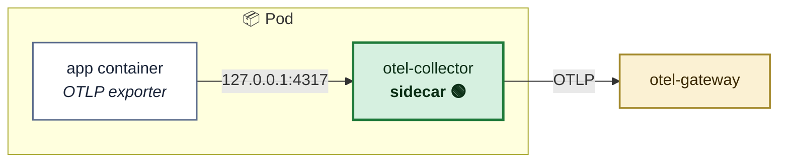
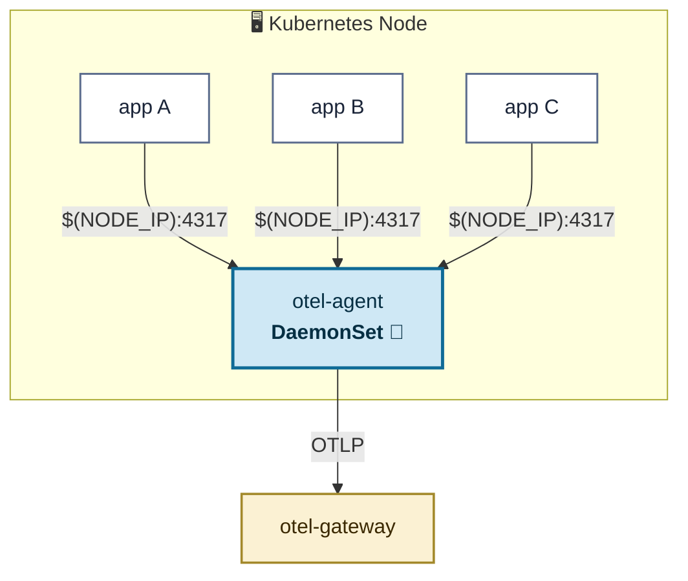
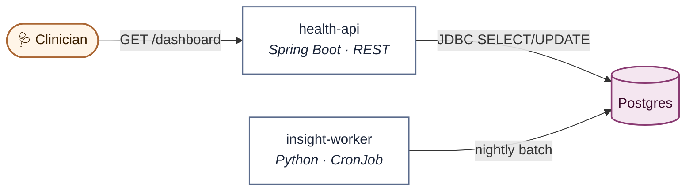
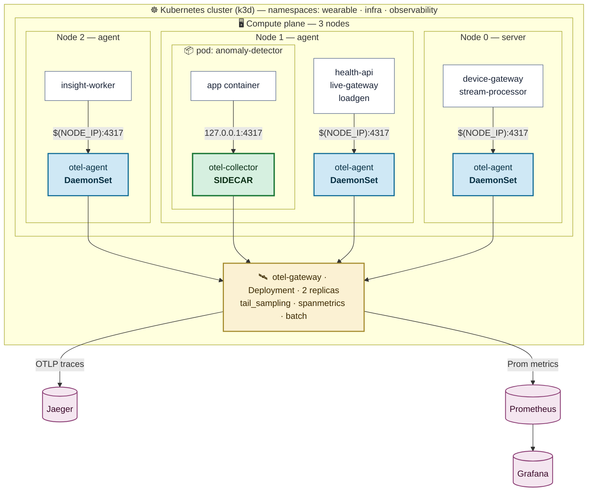
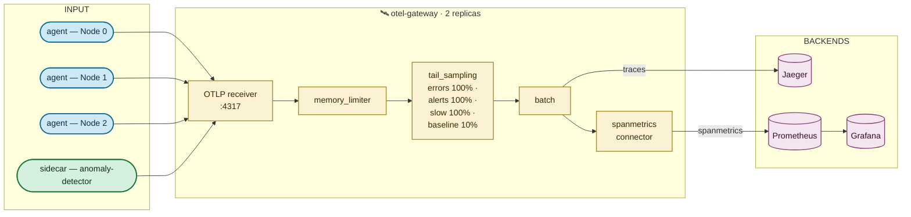
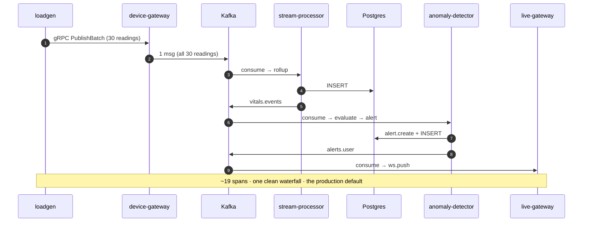
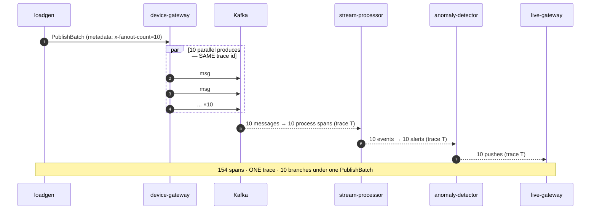
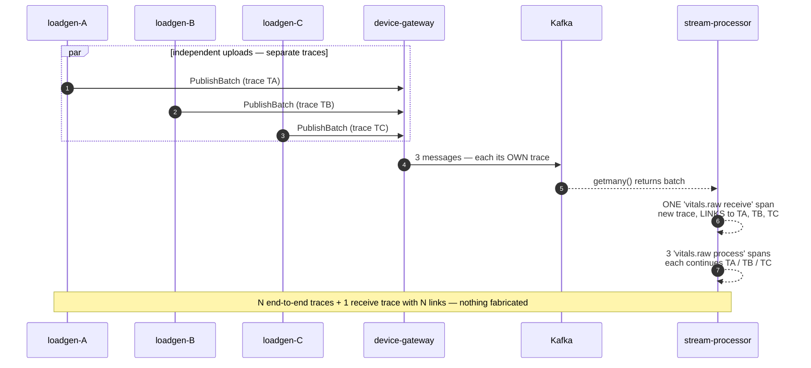

# A Production Pattern for Hybrid OpenTelemetry Collector Deployments on Kubernetes

### Sidecar where it matters, DaemonSet everywhere else — and a tail-sampled gateway that doesn't care which side a span came from.

---

> *"Pick one,"* the playbook says. **Sidecar** or **DaemonSet**. Per-pod isolation or one-collector-per-node. Choose your tribe.
>
> Production doesn't read playbooks. Production has six services that are perfectly happy sharing a node-level collector and one service whose failure mode you'd rather not couple to its neighbours. So you run **both**. The question stops being *which* and becomes *how do they coexist without your traces falling apart at the seam?*
>
> This is the story of that seam — built on a 3-node [k3d](https://k3d.io) cluster, instrumented end-to-end with OpenTelemetry, and verified by a **154-span trace** that crosses four protocols and two collector topologies without a break.

---

## Before we begin — what this article is, and who it's for

If you've ever stood in front of a whiteboard arguing whether the next service should ship with a sidecar collector or just point at the node agent, **this article is for you**. It's a hands-on, code-backed answer to that argument — written for platform engineers, SREs, and observability owners who already know what OpenTelemetry is and want to see the two collector patterns running together on a real cluster.

You won't find a pure conceptual comparison here. You'll find a working **3-node Kubernetes cluster** with:

- **Seven services** wired into a realistic pipeline (gRPC ingress → Kafka → Postgres → Kafka → WebSocket).
- **Both collector topologies in production-shaped roles** — DaemonSet agents on every node for six of those services, a sidecar collector for the one workload that earns it.
- **A single tail-sampled gateway** that ingests from both, decides what to keep, and forwards to Jaeger + Prometheus + Grafana.
- **Three distributed-tracing patterns** (single message, fan-out, batch-with-links) that you can fire from one-line `make` commands and watch in Jaeger.

What you'll come away with: a concrete reference for the **"both"** answer, copyable Mermaid diagrams of the deployment plane, the exact gateway sampling policy, and a checklist for when each pattern earns its keep. Everything is on GitHub — every diagram below is in [`docs/`](.), every command is in the [`Makefile`](../Makefile), every line of instrumentation is in [`services/`](../services).

> **TL;DR** — *Sidecar isn't an upgrade over DaemonSet, and DaemonSet isn't a budget option. They solve different problems. The right cluster runs both and lets the gateway treat them uniformly. The 154-span trace below is the proof.*

---

## 1 · Why this exists

The pipeline below is small but **deliberately realistic** — a wearable streams vitals (heart rate, SpO₂, accelerometer) into the cluster, a stream-processor rolls them into 1-minute windows, an anomaly-detector raises alerts, a live-gateway pushes those alerts to a clinician's browser over WebSocket, a health-api serves the read side, and an insight-worker `CronJob` runs nightly batch analytics.

It isn't a wearable demo. **It's a telemetry-plane demo wearing wearables as clothes.** Every service exists to answer one question:

> *Can a single user action produce a single, connected trace, when the pipeline crosses gRPC, Kafka, JDBC, and WebSocket — and when the collectors carrying that telemetry are a mix of node-level agents and a per-pod sidecar?*

The answer turns out to be **yes**. Getting there forced four design decisions worth writing down, because most blogs hand-wave the exact spot where they get hard.

---

## 2 · Sidecar vs DaemonSet — the honest comparison

Both are deployment shapes for the same OpenTelemetry Collector binary, with the same configuration language. What differs is **where it runs** and **what blast radius it has**.

### 2.1 Sidecar — a collector that lives inside the pod



The app exports to `127.0.0.1:4317`. Zero network hop, no auth, no shared-fate with other pods on the node. Per-pod config means you can scrub patient identifiers in **this** pipeline without touching the cluster's other collectors.

**The price:** one collector container per app pod. On a busy node that's a real multiplier on memory and CPU. Every workload's manifest now owns a slice of collector lifecycle — image bumps and config tweaks ripple through every deployment.

> 🟢 **Where it earns its keep:** regulated workloads, very high-volume producers that would overwhelm a shared agent, and services where a node agent's outage would be unacceptable.

### 2.2 DaemonSet — one collector per node



One agent per node. Pods discover it through Kubernetes' **downward API** — `status.hostIP` becomes the env var `NODE_IP`, and they export to `$(NODE_IP):4317`. The agent can also collect node-level signals (kubelet, host metrics, logs) — a category the sidecar simply doesn't see.

**The price:** shared fate. A misbehaving app saturates the agent that all its neighbours rely on. Per-app customization is awkward because one config serves every workload on the node.

> 🔵 **Where it earns its keep:** the default. Most services in most clusters. Cheap, operationally simple, plays well with node-level collection.

### 2.3 Side by side

|                                | 🟢 **Sidecar**                | 🔵 **DaemonSet**             |
| ------------------------------ | ----------------------------- | ---------------------------- |
| Collector instances per N pods | **N**                         | **≤ nodes**                  |
| Blast radius on failure        | one pod                       | every pod on that node       |
| Per-app config & redaction     | easy                          | hard (one config many apps)  |
| Network hop                    | localhost                     | pod → node                   |
| Node-level metrics & logs      | ❌                             | ✅                            |
| Operational unit               | every pod manifest            | one DaemonSet object         |
| Upgrade cadence                | per workload                  | one rollout                  |

> **One line to remember:** *Sidecar buys isolation at a real cost; DaemonSet trades isolation for efficiency and node visibility.*

---

## 3 · The choice on this cluster: 6 DaemonSet, 1 Sidecar — by design

I deliberately did **not** pick one. The cluster runs **both** so this repo is honest about what production looks like.

| Service                | Pattern         | Why                                                                    |
| ---------------------- | --------------- | ---------------------------------------------------------------------- |
| device-gateway         | 🔵 DaemonSet     | Stateless gRPC ingress — node-shared is fine                          |
| stream-processor       | 🔵 DaemonSet     | Kafka consumer with batching — shared agent is fine                   |
| health-api             | 🔵 DaemonSet     | Spring Boot REST + JDBC — standard read service                       |
| live-gateway           | 🔵 DaemonSet     | WebSocket push, low traffic                                           |
| insight-worker         | 🔵 DaemonSet     | CronJob — short-lived, sharing an agent is ideal                      |
| loadgen                | 🔵 DaemonSet     | Test/utility — should never sidecar test traffic                      |
| **anomaly-detector**   | 🟢 **Sidecar**   | **Alert hot path.** Highest-stakes traces; must survive a node-agent outage; likely target for per-pod PHI redaction later. |

The sidecar isn't there because the anomaly-detector *needs* a different collector binary. **It's there to demonstrate the upgrade path** — a service that "graduates" to dedicated treatment can do so without re-architecting the telemetry plane.

What this proves, beyond aesthetics: **traces stitch correctly across the two transports.** Spans flowing out of a sidecar (`127.0.0.1:4317`) merge in the gateway with spans flowing out of node agents (`$(NODE_IP):4317`) into one Jaeger view. The downstream pipeline doesn't know — and doesn't need to know — which side a span came from.

---

## 4 · Architecture — the write path


> **Figure 1 — The write path.** One left-to-right pipeline. Every arrow carries a W3C `traceparent` (Kafka headers across the bus topics, gRPC metadata across the entry hop), so the trace stays connected from device to clinician. The lone sidecar lives in `anomaly-detector` — colour-coded green throughout this doc.

## 4.1 · Architecture — the read path



> **Figure 2 — The read path.** Same Postgres, same observability plane. The clinician's dashboard and the nightly batch hit the same instance the write path persists to. Two flows, one source of truth.

---

## 5 · The deployment plane — where the collectors actually live

This is **the diagram for this article**. Services are deliberately collapsed; the **collectors, the sidecar, and the gateway** are where the topic lives.



> **Figure 3 — The collector topology.** Three nodes (k3d server + 2 agents). On every node, one **🔵 DaemonSet agent**. Inside the anomaly-detector pod on Node 1, one **🟢 sidecar** that exports directly to the same gateway. The gateway plane is one logical unit — two replicas, with tail-sampling and span-metrics — that fans telemetry out to Jaeger and Prometheus → Grafana.
>
> **Things worth noticing:** (1) every collector — agent or sidecar — talks to the *same* gateway, so the merge happens once; (2) apps reach the agent via the **downward API** (`status.hostIP` → `NODE_IP`), not via a Service IP; (3) the sidecar gets a separate green colour and a dedicated nested pod box, because it is the only collector that lives **inside** a workload pod.

## 5.1 · The telemetry pipeline inside the gateway



> **Figure 4 — Inside the gateway.** All four collector inputs (3 agents + 1 sidecar) hit the same OTLP receiver. From there: rate-limit → **tail-sample** → batch → fork. Traces go to Jaeger; the `spanmetrics` connector turns spans into RED-style histograms and ships them to Prometheus, which Grafana reads. **This is the only place sampling happens** — the agents and sidecar are pass-through.

> **Legend — colours used throughout this article**

|   | Meaning                |   | Meaning                  |
|---|------------------------|---|--------------------------|
| 🔵 | DaemonSet agent        | 🟡 | Kafka topic / gateway    |
| 🟢 | Sidecar collector      | 🟣 | Storage / sink           |
| ⚪ | Application service    | 🟠 | External actor (edge)    |

---

## 6 · Three trace shapes you'll exercise

The whole point of running both collector patterns is that **the trace shape doesn't degrade at the seam**. To prove it, the repo ships three on-demand "shapes" you can fire from `make`. Each is a different way that asynchronous messaging can either help or hurt trace integrity.

### 6.1 SINGLE — one upload, one bundled Kafka message, one trace



> **Figure 5 — SINGLE.** The whole batch rides a single Kafka message; one `traceparent` header; one trace ID end-to-end. The shape production should default to.

### 6.2 FAN-OUT — one upload, N messages, **still one trace**



> **Figure 6 — FAN-OUT.** Legitimate fan-out: one real parent, N children, bounded by the batch. Each `device-gateway kafka.produce` span is tagged `messaging.batch.message_count=10` and `messaging.batch.index=0..9`. This is the shape that tempts people into anti-patterns — the wrong move is forcing **N *independent* uploads** into one trace ID (fake parent, unbounded trace). The right move is to fan out only when there's a real single parent.

### 6.3 BATCH + LINKS — many independent uploads, span-linked on receive



> **Figure 7 — BATCH + LINKS.** The right answer for genuine multi-producer batches: [span links](https://opentelemetry.io/docs/concepts/signals/traces/#span-links). The contrast with Figure 6 is the lesson: **fan-out is parent-child because there's one real parent; batch is links because there are many.**

---

## 7 · Run it — `make` targets grouped by intent

Every command below is in [`Makefile`](../Makefile), tested, and one-shot.

### 📦 Setup / teardown

| Command            | Purpose                                                              |
| ------------------ | -------------------------------------------------------------------- |
| `make all`         | Clean setup from scratch — cluster, infra, observability, build, deploy |
| `make redeploy`    | Rebuild every service, reimport, rollout-restart                    |
| `make down-all`    | Delete cluster **and** local registry                                |
| `make ps`          | Pod status across all namespaces                                     |
| `make logs`        | Tail recent app logs                                                 |
| `make describe-failed` | Describe any non-Running pods                                    |

### 🔬 Fire the three trace shapes

| Command                                  | Shape                          | Spans                         |
| ---------------------------------------- | ------------------------------ | ----------------------------- |
| `make simulate-single ANOM=true`         | one bundled message            | ~19                           |
| `make simulate-fanout FAN=10 ANOM=true`  | 10 messages, **one** trace     | **~150**                      |
| `make simulate-batch COUNT=6`            | 6 uploads + link demo          | 6 traces + 1 linked receive   |
| `make simulate-read`                     | REST + JDBC via health-api     | small read trace              |
| `make simulate-insights`                 | one-shot insight-worker        | batch trace                   |
| `make simulate` · `simulate-stop` · `simulate-logs` | Continuous loadgen on/off/tail | —                  |

### 🎚 Sampling regime

| Command                  | Effect                                                              |
| ------------------------ | ------------------------------------------------------------------- |
| `make sampling-all`      | tail-sampling baseline → **100 %** (use for demos)                  |
| `make sampling-default`  | tail-sampling baseline → **10 %** (documented default)              |

### 🔌 Port-forwards

| Command              | UI            | URL                       |
| -------------------- | ------------- | ------------------------- |
| `make pf-jaeger`     | Jaeger        | http://localhost:16686    |
| `make pf-grafana`    | Grafana       | http://localhost:3000     |
| `make pf-prom`       | Prometheus    | http://localhost:9090     |
| `make pf-health-api` | REST          | http://localhost:8080     |
| `make pf-live-gateway` | WebSocket    | ws://localhost:7000       |
| `make pf-loadgen`    | `/simulate`   | http://localhost:8080     |
| `make portforward`   | All four obs UIs at once | —              |

### 🔎 Collector debugging

| Command                   | Purpose                              |
| ------------------------- | ------------------------------------ |
| `make otel-agent-logs`    | Tail DaemonSet agent logs            |
| `make otel-gateway-logs`  | Tail gateway logs                    |

---

## 8 · The full walkthrough — from `git clone` to a 154-span trace

A complete, copy-pasteable path. From a clean laptop to the screenshot in §9.2 is roughly **10 minutes**, almost all of it Docker builds.

### What you need installed before you start

| Tool      | Why                                        | Install                                                       |
| --------- | ------------------------------------------ | ------------------------------------------------------------- |
| Docker    | Runs the k3d cluster and builds the images | <https://docs.docker.com/get-docker/>                         |
| `kubectl` | Talks to the cluster                       | `brew install kubectl` · `gcloud components install kubectl`  |
| `make`    | Drives every command in this article       | Preinstalled on macOS and most Linux distros                  |
| Disk      | Image cache + cluster volumes              | ~4 GB free                                                    |
| Memory    | Docker Desktop allocation                  | **4 GB minimum**, 6 GB comfortable                            |

`k3d`, `helm`, and `kubectl` are installed automatically by `make prereqs` — you don't manage them by hand.

### What to do beforehand

Two one-time steps to get from a clean machine to a ready terminal.

```bash
# 1. Get the code
git clone <this-repo>
cd otel_sidecar_implementation

# 2. Install any missing CLI tools (k3d, helm, kubectl)
make prereqs
```

### The complete command sequence — in order

Every command, top to bottom. Run them in one terminal.

```bash
# ─────────── 1. BUILD THE CLUSTER ───────────
make all                                       # ~7–10 min · cluster + infra + observability + 7 services
make ps                                        # Verify every pod is Running
make describe-failed                           # Should print nothing

# ─────────── 2. PREPARE THE DEMO ───────────
make sampling-all                              # Tail-sampling baseline → 100 % so every trace lands
make simulate-stop                             # Silence the background loadgen loop
make pf-jaeger &                               # Jaeger UI at http://localhost:16686

# ─────────── 3. RUN THE THREE TRACE SHAPES ───────────
make simulate-single  ANOM=true                # Shape 1 — one bundled message  (~19 spans)
make simulate-fanout  FAN=10 ANOM=true         # Shape 2 — 10 messages in one trace  (~154 spans)
make simulate-batch   COUNT=6                  # Shape 3 — batch + span links

# ─────────── 4. (OPTIONAL) ADDITIONAL FLOWS ───────────
make simulate-read                             # REST + JDBC via health-api
make simulate-insights                         # One-shot insight-worker CronJob run

# ─────────── 5. RESET WHEN DONE ───────────
make sampling-default                          # Tail-sampling back to the documented 10 %
make simulate-stop                             # Stop the continuous loadgen loop (if started)

# ─────────── 6. TEARDOWN ───────────
make redeploy                                  # (After code changes) Rebuild and rollout-restart all apps
make down                                      # Delete the cluster, keep the local registry
make down-all                                  # Delete the cluster AND the local registry
```

Each `simulate-*` command prints a `trace_id` on success. Paste it into Jaeger's **Lookup by Trace ID** box (top right) — that takes you straight to the waterfall.

### What `make all` actually does

A single command, six logical phases:

1. Creates a 3-node k3d cluster — `k3d-wearable-server-0`, `k3d-wearable-agent-0`, `k3d-wearable-agent-1`.
2. Brings up infrastructure in the `infra` namespace — Kafka and Postgres.
3. Brings up observability in the `observability` namespace — **OpenTelemetry DaemonSet agents**, the **OpenTelemetry gateway** (2 replicas), Jaeger, Prometheus, Grafana.
4. Builds all 7 service Docker images.
5. Imports the images into k3d's container store on every node.
6. Deploys the apps to the `wearable` namespace — including the **anomaly-detector pod with its sidecar collector**.

When `make all` returns, the cluster is fully wired and ready for traces.

### Troubleshooting

- **Pods stuck `Pending`** → Docker doesn't have enough memory. Raise Docker Desktop's allocation to ≥ 4 GB and run `make redeploy`.
- **`make all` fails on `cluster-up` with a port-binding error** → a stale Docker network from an earlier run is squatting on the port. Fix: `make down-all && make all`.

### What "good" looks like — fan-out trace acceptance criteria

If the hero shot landed cleanly, your fan-out trace in Jaeger should match the table below. If any row is off by an order of magnitude, the cluster is in a partial-deploy state — `make redeploy` and try again.

| What                                       | Expected                                                                |
| ------------------------------------------ | ----------------------------------------------------------------------- |
| Total spans                                | **~154**                                                                |
| Services                                   | `loadgen, device-gateway, stream-processor, anomaly-detector, live-gateway` |
| `device-gateway kafka.produce` spans       | **10**, each with `messaging.batch.message_count=10`, `index=0..9`      |
| `stream-processor vitals.raw process`      | **10**                                                                  |
| `anomaly-detector alert.create`            | **10**                                                                  |
| `live-gateway ws.push`                     | **10**                                                                  |
| Collector mix proof — Process tags         | `otel.collector.mode = agent` on most spans; `sidecar` on anomaly-detector spans |

---

## 9 · Screenshots — drop yours here

> All filenames live under [`docs/screenshots/`](screenshots/). Replace each placeholder with your own capture from the walkthrough above. Captions describe what reviewers should see *before* the image loads.

### 9.1 The baseline waterfall — one bundled message

*~19 spans across 5 services; one `kafka.produce` with `messaging.batch.message_count=1`. The reference shape for "this is what one user action looks like".*


### 9.2 The hero shot — 10 messages, one trace

*154 spans, all five services, 10 branches under one `PublishBatch`. Visual proof that fan-out can be done without forging parents.*


### 9.3 BATCH + LINKS — N traces, one link-rich receive

*The `vitals.raw receive` span in a trace of its own. The **Refs** panel shows N "Follows from" links pointing back to N independent producer traces.*


### 9.4 The read flow — REST in, JDBC out

*A clean HTTP-server span on health-api with child JDBC `SELECT` / `UPDATE` spans. The read side is in the same plane as the write side — no special instrumentation.*


### 9.5 Jaeger Service Map — the DAG that emerges from real traffic

*`Jaeger → System Architecture`. The graph should match Figures 1 + 2 exactly. If it doesn't, you have an instrumentation gap.*


### 9.6 The mixed-collector proof

*Open any anomaly-detector span and inspect Process tags → `otel.collector.mode = sidecar`. Compare to any device-gateway span → `otel.collector.mode = agent`. Same trace, two collector modes, no boundary visible to the trace consumer.*


---

## 10 · Lessons that survived the build

1. **Sidecar vs DaemonSet is the wrong framing.** The right framing is *"what's the right blast radius for this workload's telemetry?"* Most answers are DaemonSet. Some answers are sidecar. The right design lets you mix without rebuilding.
2. **`traceparent` is non-negotiable on Kafka.** Without it, the downstream side of every async hop is a new trace, and you'll spend the rest of your life copy-pasting trace IDs between tabs.
3. **Bundle by default; fan out deliberately; link on receive.** Pick the wrong shape and you'll either drown in spans or fabricate parents.
4. **Tail-sample at the gateway, never the agent.** The agent doesn't have the whole-trace view; the gateway does. Multiple gateway replicas need a trace-aware load-balancing exporter or 100 % sampling for demos.
5. **Make the demos one command each.** `make simulate-fanout FAN=10` beats a five-step README every time. The first teammate who has to reproduce your trace will either love or hate this choice.

---

## 11 · Further reading in this repo

- [`docs/architecture/full-system-architecture.md`](architecture/full-system-architecture.md) — deeper Mermaid reference: pipeline, DaemonSet topology, telemetry pipeline, sequence diagrams.
- [`docs/architecture/01-sidecar-vs-daemonset.png`](architecture/01-sidecar-vs-daemonset.png) · [`02-high-level-architecture.png`](architecture/02-high-level-architecture.png) · [`03-observability-plane.png`](architecture/03-observability-plane.png) — Excalidraw visuals.
- [`Makefile`](../Makefile) — every command in §7.
- [`services/device-gateway/internal/server/server.go`](../services/device-gateway/internal/server/server.go) — the fan-out producer (reads `x-fanout-count` gRPC metadata).
- [`services/stream-processor/main.py`](../services/stream-processor/main.py) — the batch consumer with links + per-message process spans.

---

*If you'd build something differently — a different sampling policy, different sidecar candidates, a different trace shape for messaging — I'd genuinely like to hear about it. Open an issue or send a PR. The cluster comes up in ten minutes; the conversation it enables is worth more than the cluster.*
