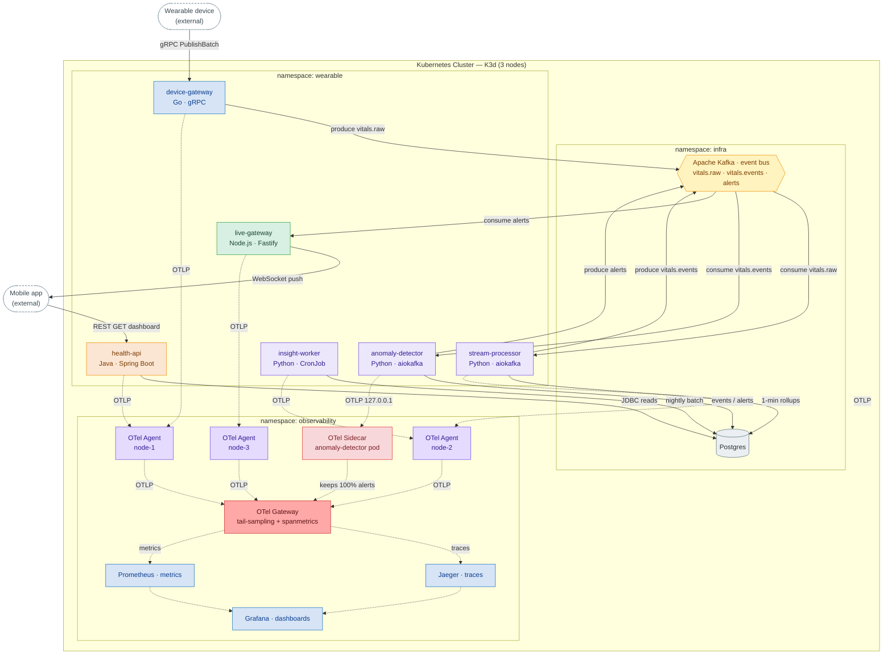
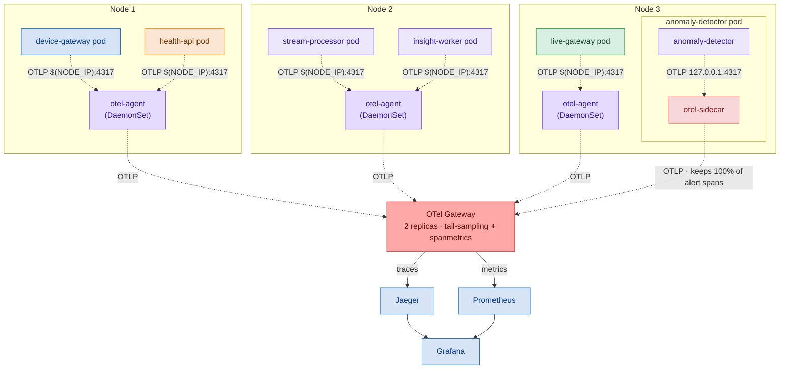
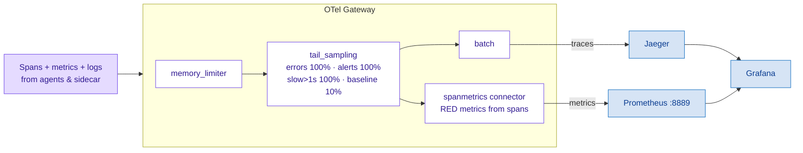
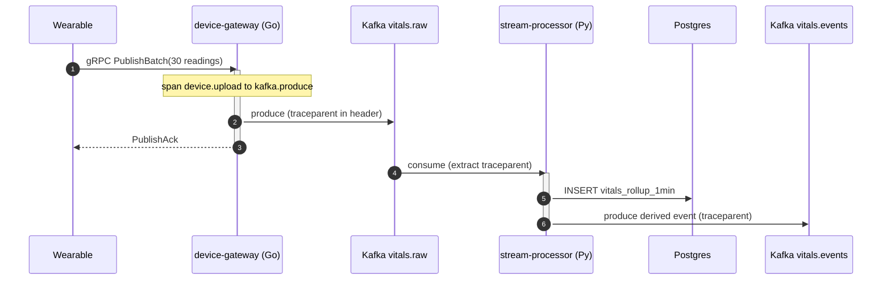
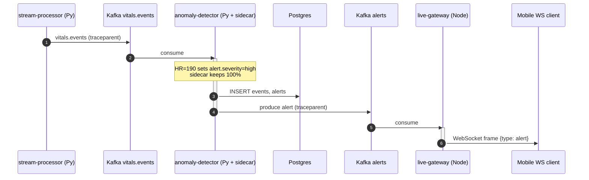
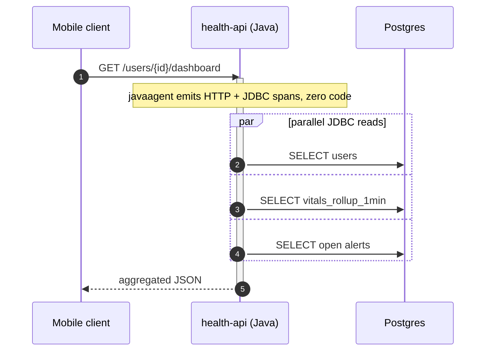
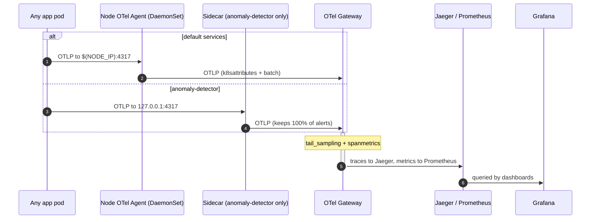

# WearableHealth — Full System Architecture

A complete, component-by-component view of the WearableHealth OpenTelemetry POC: a
polyglot health-telemetry platform on a 3-node **K3d** Kubernetes cluster, with the
**DaemonSet agent + Gateway** collection topology and one deliberate **sidecar** exception.

All diagrams are inline Mermaid — they render in GitHub, the VS Code *Markdown Preview
Mermaid* extension, and any Mermaid viewer.

---

## Component inventory

| Namespace | Component | Tech / Framework | Role |
|---|---|---|---|
| *(external)* | **Wearable device** | — | Pushes vitals over gRPC |
| *(external)* | **Mobile app** | — | REST reads + WebSocket alerts |
| `wearable` | **device-gateway** | Go · gRPC | Ingest, Kafka producer (`vitals.raw`) |
| `wearable` | **stream-processor** | Python · aiokafka | Rollups → Postgres, derive `vitals.events` |
| `wearable` | **anomaly-detector** | Python · aiokafka **(+ sidecar)** | Rule-based detection, produce `alerts` |
| `wearable` | **live-gateway** | Node.js · Fastify | Consume `alerts` → WebSocket push |
| `wearable` | **health-api** | Java · Spring Boot | REST + JDBC reads |
| `wearable` | **insight-worker** | Python · CronJob | Nightly batch scoring |
| `infra` | **Apache Kafka** | KRaft | Event bus: `vitals.raw` → `vitals.events` → `alerts` |
| `infra` | **Postgres** | — | Rollups, events, alerts, insights |
| `observability` | **OTel Agent** | Collector Contrib | **DaemonSet — 1 per node** (node-1/2/3) |
| `observability` | **OTel Sidecar** | Collector Contrib | Runs *inside* the anomaly-detector pod |
| `observability` | **OTel Gateway** | Collector Contrib · 2 replicas | Tail-sampling + spanmetrics |
| `observability` | **Jaeger** | — | Trace storage + UI |
| `observability` | **Prometheus** | — | RED metrics (scrapes gateway `:8889`) |
| `observability` | **Grafana** | — | Unified dashboards |

---

## 1. Full architecture (namespaces, every component)

Solid arrows = **business data** · dotted arrows = **OpenTelemetry telemetry**.

**Every solid arrow carries `traceparent`** — that is what keeps one trace ID alive
across four languages and across each Kafka producer/consumer boundary, with **zero
correlation code in the apps**.

---

## 2. The DaemonSet collection topology (one agent per node)

A DaemonSet runs **exactly one collector pod per node**. Application pods are scheduled
across the nodes; each pod's SDK exports to *its own node's* agent over the loopback/host
path — never across the network to a central collector. `anomaly-detector` is the lone
exception: it ships an OTel **sidecar** in its pod and exports to `127.0.0.1`.

> **Why a sidecar for anomaly-detector?** The gateway tail-samples routine traffic to
> ~10%. The sidecar lets that one service enforce a per-app policy — **keep 100% of alert
> spans** — so a high-severity alert trace is never dropped. Every other service uses the
> cheaper shared node agent. This is the documented exception, not the default.

---

## 3. Telemetry pipeline (what the Gateway does)

**Apps never name a backend.** Swapping Jaeger for Grafana Tempo is a one-block edit in
the gateway config; no service redeploys. RED metrics are derived from spans by the
`spanmetrics` connector — **no metrics code in any service**.

---

## 4. Traced flows (sequence diagrams)

### Flow 1 · Vitals ingestion (hot path)

### Flow 2 · Anomaly alert — 4 languages, 1 trace

### Flow 3 · Dashboard query (Java auto-instrumented)

### Flow 4 · Telemetry path (every span)

---

## 5. Key facts

- **Topology:** 6 services use the node **DaemonSet agent**; `anomaly-detector` uses a
  **sidecar** (the one exception, to keep 100% of alert traces).
- **DaemonSet math:** collectors scale with **nodes** (3 here), not pods — far cheaper
  than one sidecar per pod at scale.
- **Tail sampling (gateway):** errors, alerts, and slow (&gt;1s) traces kept at **100%**;
  routine traffic at **10%**.
- **RED metrics:** derived from spans by the `spanmetrics` connector — no app metric code.
- **Propagation:** `traceparent` flows across gRPC, Kafka, JDBC, and WebSocket — one trace
  ID across Go, Python, Java, and Node.js.

*Tags: opentelemetry, kubernetes, daemonset, sidecar, observability, microservices, mermaid*
