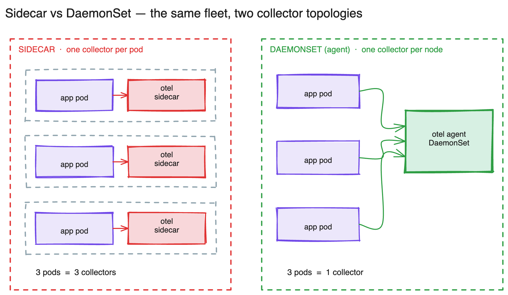
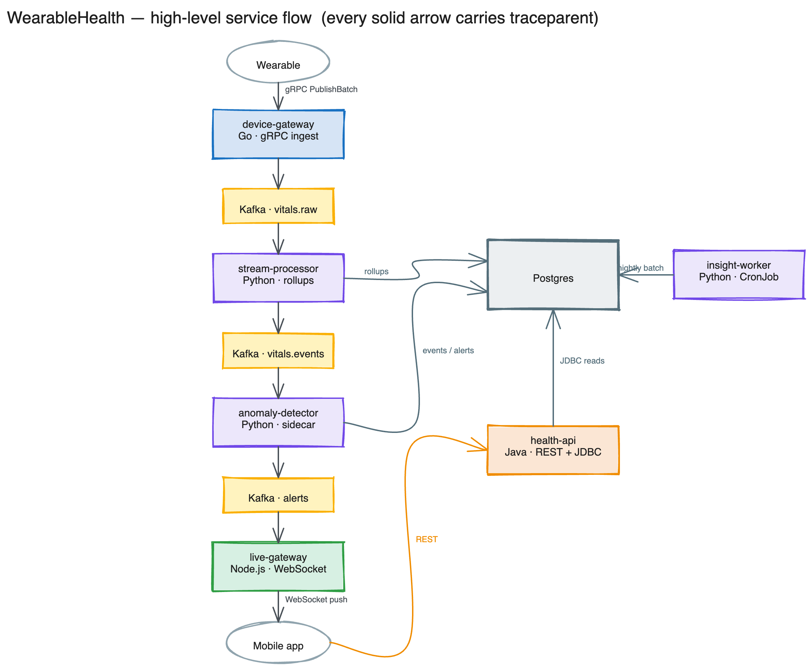
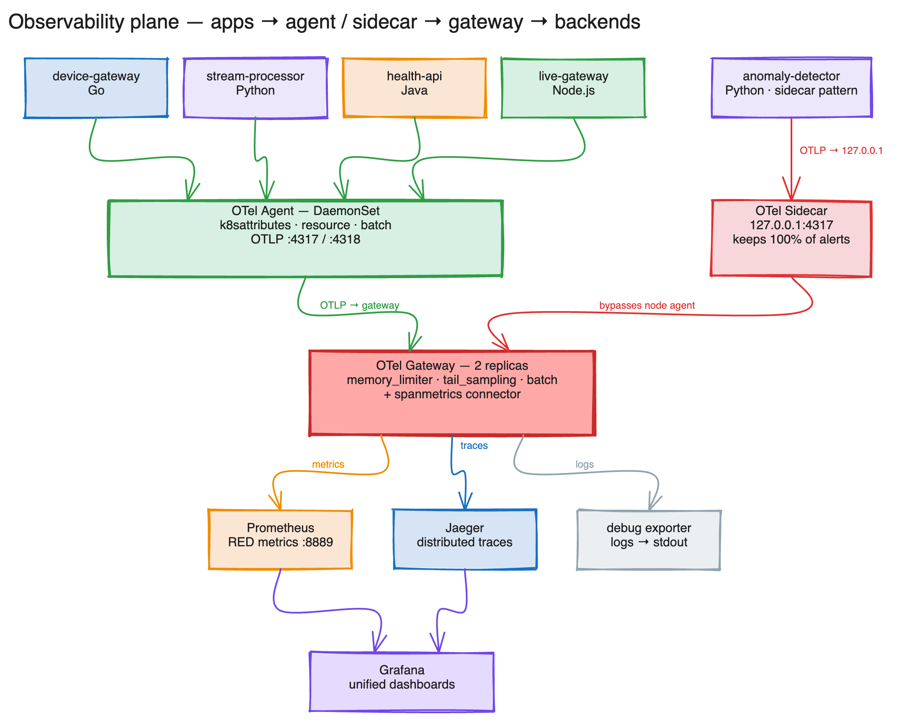
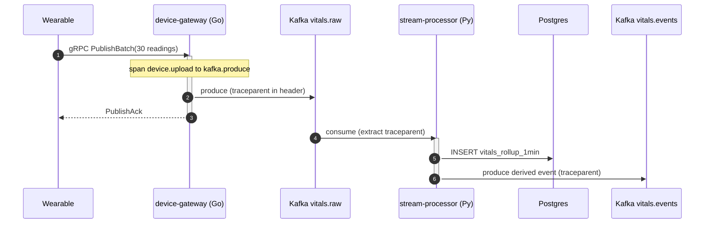
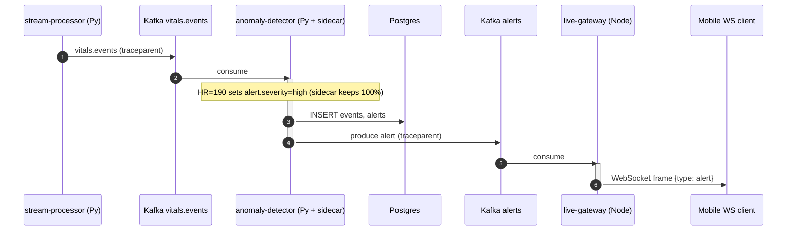
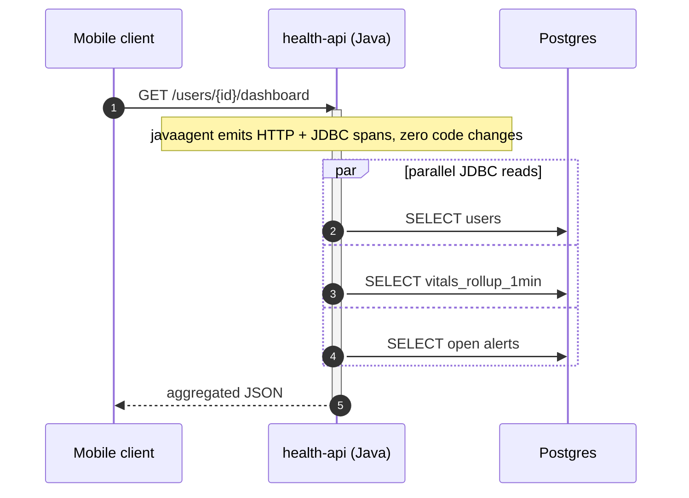
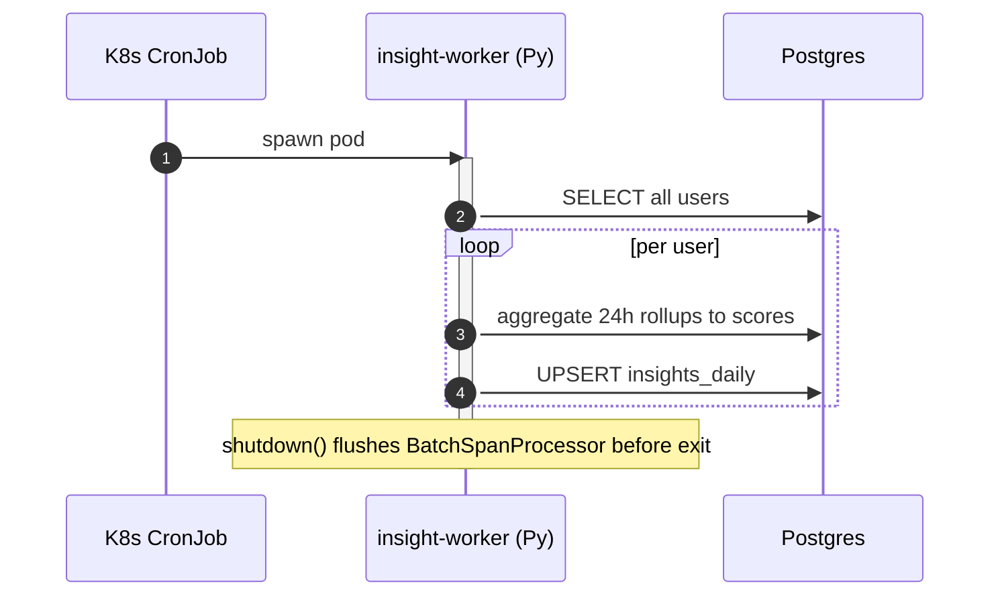

# WearableHealth — OpenTelemetry Architecture

*A polyglot health-telemetry POC that proves the **DaemonSet agent + Gateway** collection topology across Go, Python, Java, and Node.js — with one deliberate **sidecar** exception. The architecture diagrams below are generated as editable Excalidraw files and exported to PNG so they render anywhere (VS Code, GitHub, the browser) with no extension.*

> **Diagram sources.** Every figure links its editable `.excalidraw` file. Open it in [excalidraw.com](https://excalidraw.com) or the VS Code *Excalidraw* extension to tweak it; the `.png`/`.svg` next to it are the rendered exports embedded here.

---

## 1. The argument: Sidecar vs DaemonSet

"Run the OTel agent as a sidecar" sounds like one pattern. It's actually a choice between topologies, and the choice has real cost and reliability consequences. The same fleet collected two ways:



> 📐 Edit: [`docs/architecture/01-sidecar-vs-daemonset.excalidraw`](../architecture/01-sidecar-vs-daemonset.excalidraw)

**3 pods → 3 collectors** on the left; **3 pods → 1 collector** on the right. That ratio is the whole argument.

| Dimension | Sidecar | Agent (DaemonSet) |
|---|---|---|
| Collectors at 600 pods | 600 | ~50 |
| Memory overhead **per app pod** | +80–150 MB | 0 |
| Per-app config flexibility | Excellent | Uniform per node |
| Failure blast radius | One pod | All pods on a node |
| App → collector hop | `127.0.0.1:4317` (no network) | `$(NODE_IP):4317` (downward API) |
| Rolling collector upgrade | Touches every workload | Touches one DaemonSet |
| OTel's own name for it | "sidecar" | **"agent"** (the canonical term) |

**Cost math at 50 nodes / 600 pods:**

- **Sidecar:** 600 × ~100 MB / ~50 mCPU ≈ **60 GB RAM, 30 cores** reserved.
- **DaemonSet:** 50 × ~250 MB / ~250 mCPU ≈ **12.5 GB RAM, 12.5 cores**.

That's **~4.8× less memory** and **~2.4× less CPU** — and the gap widens with scale, because the DaemonSet count grows with *nodes*, not *pods*.

**When the sidecar still wins** — reach for one only when you can name the constraint:

1. **Per-app sampling** — a compliance-critical service that must keep **100%** of its traces.
2. **Strict tenant isolation** — one tenant's telemetry must never share a buffer with another's.
3. **A chatty, high-cardinality service** that would otherwise monopolize a shared node agent.

This POC is a deliberate hybrid: **6 of 7 services** use the DaemonSet agent; **`anomaly-detector`** runs a sidecar to demonstrate constraint #1. Same cluster, both patterns, one `diff` apart.

---

## 2. High-level architecture — the service flow

The domain is a continuous health-telemetry platform à la Fitbit/Whoop: wearables push vitals → derived signals → anomaly detection → real-time alerts → dashboards and daily insights.



> 📐 Edit: [`docs/architecture/02-high-level-architecture.excalidraw`](../architecture/02-high-level-architecture.excalidraw)

**Every solid arrow carries `traceparent` in its headers.** That's what lets a single trace ID survive across four languages and across the Kafka producer/consumer boundary — with **zero correlation code in the apps**.

The seven services:

| Service | Language | Role | Collection |
|---|---|---|---|
| **device-gateway** | Go | gRPC ingest, Kafka producer | DaemonSet agent |
| **stream-processor** | Python | Kafka in/out, Postgres rollups | DaemonSet agent |
| **anomaly-detector** | Python | rule-based detection, alert producer | **sidecar** |
| **health-api** | Java / Spring Boot | REST + JDBC reads | DaemonSet agent |
| **live-gateway** | Node.js / Fastify | Kafka consumer → WebSocket push | DaemonSet agent |
| **insight-worker** | Python (CronJob) | nightly batch scoring | DaemonSet agent |
| **loadgen** | Go | simulated wearables + `/simulate` endpoint | DaemonSet agent |

---

## 3. Low-level architecture — the observability plane

Three collector roles, each a distinct config. This is the heart of the POC.



> 📐 Edit: [`docs/architecture/03-observability-plane.excalidraw`](../architecture/03-observability-plane.excalidraw)

Apps emit all signals to their node-local **Agent** (or, for `anomaly-detector`, its **Sidecar**). The **Gateway** is the only component that knows about backends — it tail-samples traces to Jaeger, derives RED metrics to Prometheus, and ships logs to a debug exporter. **Grafana** unifies the dashboards.

### 3.1 The Agent (DaemonSet) — one per node

Apps send OTLP to their **node-local** agent at `$(NODE_IP):4317`, where `NODE_IP` is injected by the Kubernetes **downward API**:

```yaml
- name: NODE_IP
  valueFrom:
    fieldRef:
      fieldPath: status.hostIP
- name: OTEL_EXPORTER_OTLP_ENDPOINT
  value: "$(NODE_IP):4317"
```

Its pipeline (`otel-config/agent-collector.yaml`): `k8sattributes` (tags `k8s.namespace/pod/node/deployment.name` + `service.version`) → `resource` (`deployment.environment=local-k3d`) → `batch` + `memory_limiter`, then exports to the gateway with a persistent sending queue + retry so a brief gateway blip doesn't drop spans.

### 3.2 The Gateway — central, 2 replicas

Where the heavy, stateful processing lives (`otel-config/gateway-collector.yaml`).

**Tail sampling** — decisions made *after* a full trace is assembled (`decision_wait: 10s`):

| Policy | Type | Keeps |
|---|---|---|
| errors | `status_code: [ERROR]` | **100%** |
| alert-spans | `alert.severity ∈ {high, critical}` | **100%** |
| slow-traces | `latency > 1000ms` | **100%** |
| baseline | `probabilistic 10%` | 10% of everything else |

**`spanmetrics` connector** derives RED metrics (rate / errors / duration) from spans — **no application metric code anywhere** — and exports them to Prometheus. Traces go to Jaeger.

### 3.3 The Sidecar — the deliberate exception

`anomaly-detector` runs **two containers in one pod**: the app and an `otel/opentelemetry-collector-contrib` sidecar. The app exports to `127.0.0.1:4317` instead of `$(NODE_IP)`:

```yaml
- name: OTEL_EXPORTER_OTLP_ENDPOINT
  value: "127.0.0.1:4317"   # ← the sidecar, not the node agent
```

The sidecar stamps `otel.collector.mode=sidecar` and sends straight to the gateway, bypassing the node agent — a private, lower-latency export path with a clean place to enforce per-app policy.

### The whole path, in one line

```
app SDK ──OTLP──► [agent @ NODE_IP:4317  |  sidecar @ 127.0.0.1:4317]
        ──OTLP──► gateway (tail-sample + spanmetrics) ──► Jaeger + Prometheus ──► Grafana
```

**Apps never name a backend.** Swapping Jaeger for Grafana Tempo is a one-block edit in the gateway config; not a single service redeploys.

---

## 4. Traced flows (sequence diagrams)

Each flow produces one connected trace in Jaeger. The only "glue" is `traceparent` injection/extraction at each hop — that's why the trace doesn't shatter.

### Flow 1 · Vitals ingestion (the hot path)



### Flow 2 · Anomaly alert — the showcase (4 languages, 1 trace)



### Flow 3 · Dashboard query (Java auto-instrumented)



### Flow 4 · Scheduled batch (CronJob, explicit flush)



---

## 5. How to run

```bash
make prereqs     # auto-detects OS, installs k3d/kubectl/helm
make all         # cluster + infra + observability + build 7 images + deploy (~8 min first run)
make ps          # confirm pods Running across infra / observability / wearable
```

UIs (or `make portforward` if ports are taken):

```
http://localhost:3000     # Grafana   (admin/admin)
http://localhost:16686    # Jaeger
http://localhost:9090     # Prometheus
```

**Generate load — two modes:**

```bash
make simulate                    # continuous loop: DEVICE_COUNT random-UUID wearables, batch every 5s
make simulate-once ANOM=true     # fire exactly one anomalous batch, returns its trace_id
make pf-loadgen                  # expose loadgen on :8080
curl -XPOST "localhost:8080/simulate?anomalous=true"
```

Loop-driven spans are tagged `trigger=loop`; on-demand ones `trigger=manual` — so you can isolate exactly the trace you just fired.

---

## 6. Proving it works with the DaemonSet

| # | Check | Command |
|---|---|---|
| 1 | One agent **per node**, not per pod | `kubectl -n observability get pods -l app=otel-agent -o wide` vs `kubectl get nodes` |
| 2 | Two patterns differ by one env var | `grep -A2 OTEL_EXPORTER_OTLP_ENDPOINT k8s/apps/device-gateway.yaml` (`$(NODE_IP)`) vs `…/anomaly-detector.yaml` (`127.0.0.1`) |
| 3 | Telemetry flows through the agent | `make otel-agent-logs`, `make otel-gateway-logs` |
| 4 | End-to-end trace across 4 languages | `make simulate-once ANOM=true` → search the `trace_id` in Jaeger |
| 5 | Sidecar leaves a fingerprint | group Jaeger spans by `otel.collector.mode=sidecar` |
| 6 | Metrics prove the connector ran | query `calls_total` by `service.name` in Prometheus |

If all six pass, the topology is doing exactly what the diagrams claim: **one collector per node + a central gateway, collecting an entire 4-language fleet — with a single sidecar exception visible in both the manifests and the telemetry.**

> **OTel deployment topology is an architectural decision, not a config detail.** Default to **DaemonSet agent + Gateway**, and reach for a sidecar only when you can name the constraint it solves — exactly as `anomaly-detector` does here.

---

## Regenerating the diagrams

The Excalidraw diagrams are generated from a script, so they stay in sync and never drift:

```bash
cd docs/architecture
python3 gen_excalidraw.py     # writes the three .excalidraw files
npm install playwright        # one-time; export uses your local Chrome (no browser download)
node export.mjs               # renders matching .svg + .png
```

*Tags: opentelemetry, kubernetes, observability, microservices, golang, python, java, nodejs, excalidraw*
