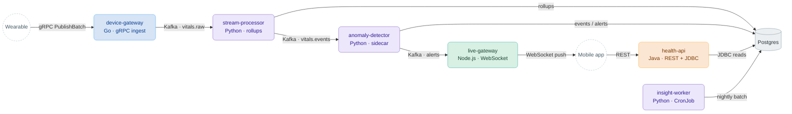
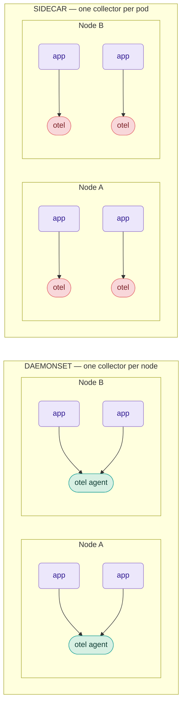
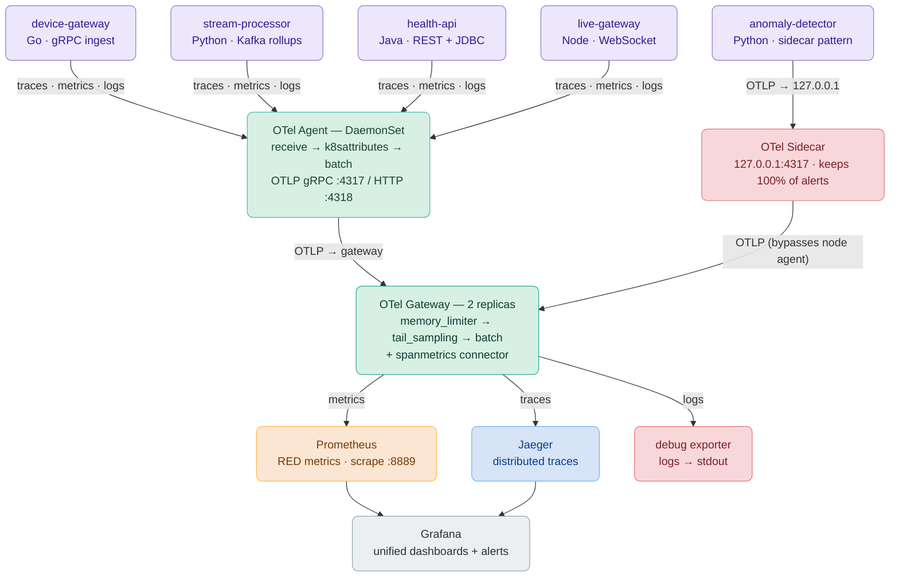
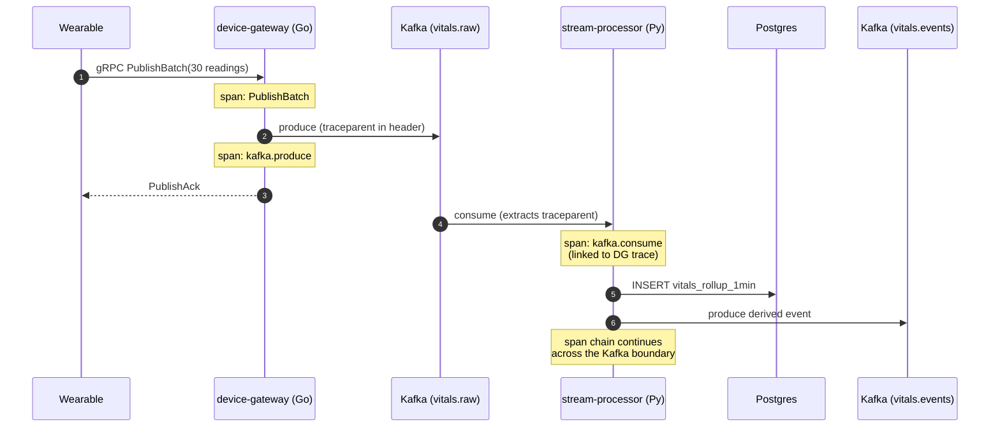
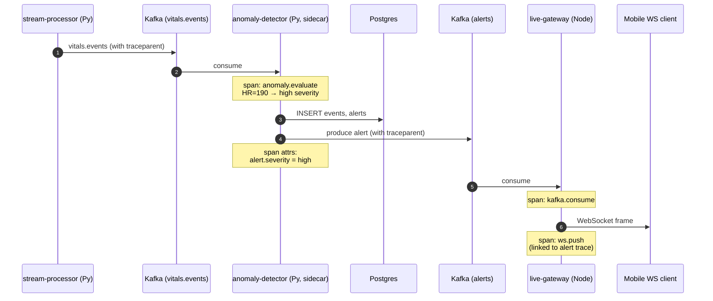
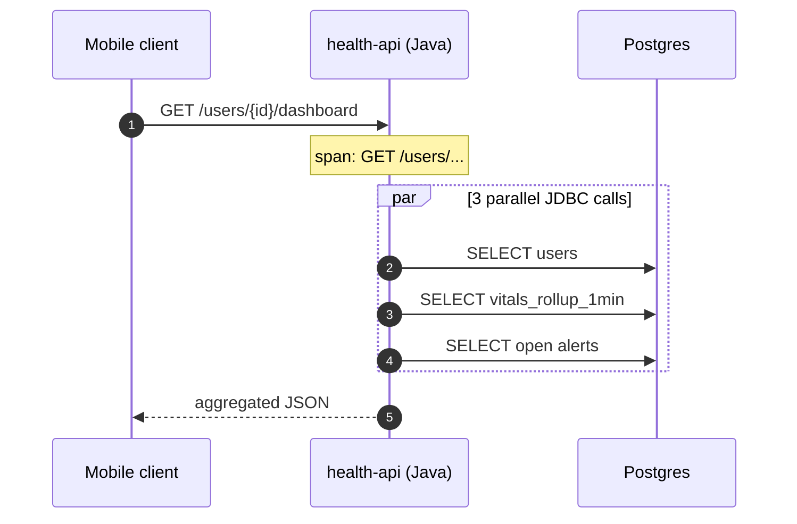
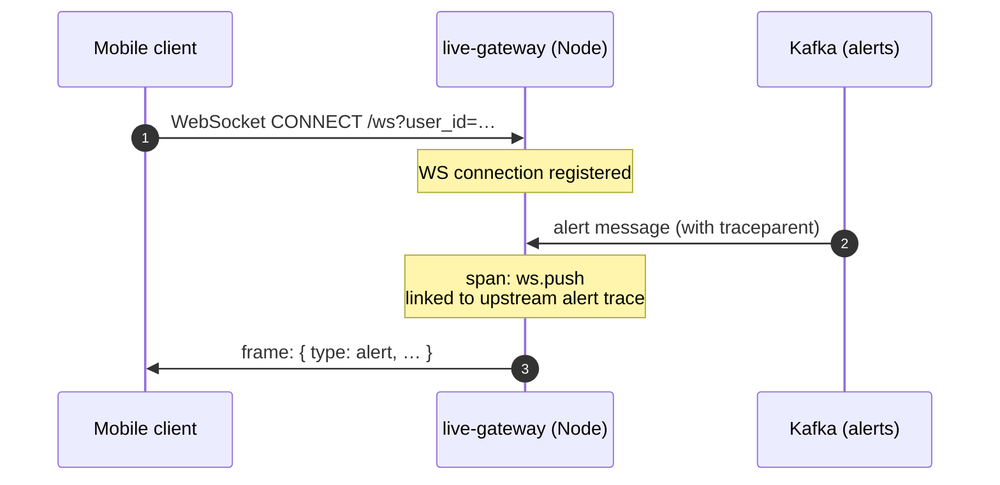
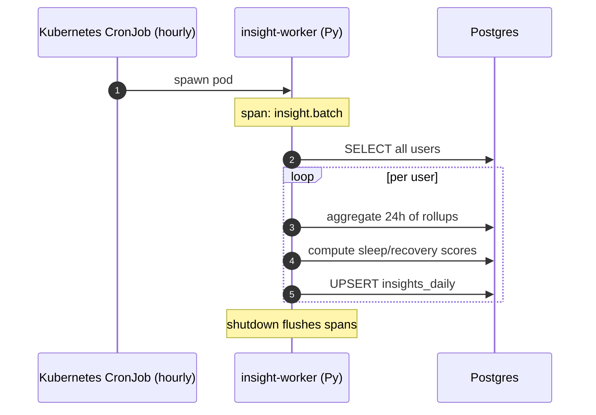

# Observability Without Vendor Lock-in: Building a Polyglot OpenTelemetry Demo on K3d

*A hands-on walkthrough of the OTel Agent + Gateway pattern across Go, Python, Java, and Node.js — and why we deliberately walked away from the sidecar pattern we originally planned.*

---

## TL;DR

We built **WearableHealth** — a continuous health telemetry platform with 6 microservices in 4 languages, communicating over gRPC, REST, Kafka, Postgres, WebSocket, and async CronJobs. Every service ships traces, metrics, and logs through OpenTelemetry to a centralized Jaeger + Prometheus + Grafana stack. The whole thing runs on a local 3-node K3d cluster.

The interesting story is not the demo itself, but the **architectural choice between sidecar and DaemonSet collectors** — a decision that gets harder, not easier, as your fleet grows. We started planning sidecars, switched to DaemonSets, then ended up with a deliberate hybrid. This post explains why.

---

## 1. The Original Plan — and Why We Changed It

The starting brief was simple: "OTel Agent as a sidecar in each pod."

The phrase "agent as a sidecar" is so common in conversations that it sounds like one pattern. It isn't. In the OpenTelemetry world, there are *three* deployment topologies:

| Topology | Where it runs | Cardinality |
|---|---|---|
| **Sidecar** | An extra container inside every app pod | One per app pod |
| **Agent (DaemonSet)** | One pod per Kubernetes node | One per node |
| **Gateway** | A regular Deployment, replicated | A handful of replicas |

A production OTel deployment usually combines two of these — most commonly **Agent + Gateway**. Pure sidecars are rare. Pure gateways exist but lose useful local context.

### Visual: Sidecar vs DaemonSet


4 pods → 4 collectors on the left; 4 pods → 2 collectors on the right. That ratio is the whole argument.

### Pros and Cons in One Table

| Dimension | Sidecar | DaemonSet (Agent) |
|---|---|---|
| **Collectors at 1000 pods** | 1000 | ~50 (typical node count) |
| **Memory overhead per pod** | +80–150 MB | 0 in the app pod |
| **Per-app config flexibility** | Excellent — every app can have unique sampling/processors | Uniform across all pods on the node |
| **Failure blast radius** | One pod | All pods on that node |
| **App → collector hop** | `localhost:4317` (zero network) | `$(NODE_IP):4317` via downward API |
| **Telemetry isolation** | Strong — apps never share a collector | Weak — chatty neighbor can affect others |
| **Rolling collector updates** | Touches every workload | Touches one DaemonSet |
| **Resource utilization** | Wasteful — many idle collectors | Efficient — one busy collector |
| **OTel's own naming** | "sidecar" | **"agent"** (this is the canonical name) |
| **Production prevalence** | Rare for telemetry | Standard (Datadog Agent, Splunk Forwarder, Fluentd, etc.) |

### The Scale Argument, with Numbers

Take a realistic mid-size cluster: **50 nodes, 600 pods**.

**Sidecar option:** 600 collectors. At a conservative 100 MB / 50 mCPU each:
- Memory: **60 GB**
- CPU reservation: **30 cores**

**DaemonSet option:** 50 collectors. At a heavier 250 MB / 250 mCPU each (since they handle more load):
- Memory: **12.5 GB** (4.8× less)
- CPU reservation: **12.5 cores** (2.4× less)

For a 10× larger cluster the gap widens further because DaemonSet count grows linearly with nodes, not pods.

### When the Sidecar Argument Wins

The sidecar pattern isn't strictly worse — it has three legitimate niches:

1. **Per-app sampling policy.** If one service must keep 100% of its traces (compliance, regulatory, financial), giving it a private collector with its own sampling config is cleaner than shoehorning that into the cluster-wide agent config.
2. **Strict tenant isolation.** Multi-tenant clusters where one tenant must never see another tenant's telemetry buffer.
3. **Apps with extreme cardinality.** A single noisy app can monopolize a shared agent. A sidecar isolates the noise.

For everything else — and this is most production fleets — the **DaemonSet agent + Gateway** topology wins.

### Our Final Choice: Deliberate Hybrid

In WearableHealth we run:
- **5 of 6 services** on the DaemonSet agent (the standard, cost-efficient path).
- **1 service** — `anomaly-detector` — on a sidecar collector. Not because we need to, but because the alert-detection pipeline benefits from a per-app sampling rule (100% of alert spans are captured even when the gateway is tail-sampling everything else at 10%).

This way the repo demonstrates both patterns in the same cluster, and a reader can `diff` two Kubernetes manifests to see exactly what changes.

---

## 2. Infrastructure — Running This on Mac, Windows, or Linux

The full stack runs locally on **K3d**, a wrapper that boots a real K3s Kubernetes cluster inside Docker containers. K3d makes a multi-node cluster cheap on a laptop.

### Common prerequisites (all OSes)

- Docker (Desktop or Engine)
- 8 GB RAM allocatable to Docker (6 GB is the floor)
- 4 CPU cores
- 20 GB free disk space

### macOS

The smoothest path. Install Docker Desktop, then run `make prereqs`:

```bash
# Docker Desktop: install from https://docker.com/products/docker-desktop
# Set Docker Desktop → Settings → Resources: 8 GB RAM, 4 CPU
brew install make    # if not already present
git clone <repo>
cd otel_sidecar_implementation
make prereqs         # installs k3d, helm, kubectl via brew
make all             # full setup (~8 minutes first time)
```

Apple Silicon and Intel both work — the Makefile auto-detects host architecture and builds matching images via buildx.

### Linux (Ubuntu / Debian / Fedora)

The most native experience.

```bash
# Install Docker
curl -fsSL https://get.docker.com | sh
sudo usermod -aG docker $USER       # log out and back in

# Install k3d, kubectl, helm
curl -s https://raw.githubusercontent.com/k3d-io/k3d/main/install.sh | bash
curl -LO "https://dl.k8s.io/release/$(curl -L -s https://dl.k8s.io/release/stable.txt)/bin/linux/amd64/kubectl"
sudo install -o root -g root -m 0755 kubectl /usr/local/bin/kubectl
curl https://baltocdn.com/helm/signing.asc | sudo apt-key add -
sudo apt-get install helm

# Then
make all
```

On Linux, port-forwarding tends to be the most reliable path for the UIs (K3d's loadbalancer port mapping sometimes conflicts with system services on `:3000`).

### Windows

Two viable paths. **WSL2 is strongly recommended** because the build flow uses bash, make, and Linux containers natively.

**Path 1 — WSL2 + Docker Desktop (recommended):**

1. Install WSL2 + Ubuntu from the Microsoft Store.
2. Install Docker Desktop with WSL2 backend enabled.
3. Inside the Ubuntu shell, follow the Linux steps above.
4. Access the UIs from your Windows browser at `http://localhost:3000` etc. — WSL2 forwards them automatically.

**Path 2 — Rancher Desktop or native Docker:**

Works if you avoid WSL, but you'll need to:
- Run `make` from Git Bash or MSYS2 (Git for Windows includes them).
- Adjust path separators in scripts (the Makefile already uses POSIX paths).
- Some commands (`uname -m`, `xargs`) need Git Bash, not cmd.

Expect 30–50% slower image builds on native Windows compared to WSL2.

### What `make prereqs` actually installs

| Tool | Why |
|---|---|
| **Docker** | Runs everything (K3d nodes are Docker containers) |
| **k3d** | Spins up K3s clusters inside Docker — multi-node, fast, ephemeral |
| **kubectl** | Standard Kubernetes CLI |
| **helm** | Used only as fallback; the repo uses raw YAML manifests for didactic clarity |

The Makefile detects which are missing and only installs those.

---

## 3. The Architecture — Four Diagrams

> *Four Mermaid diagrams, each answers one question. They render natively in GitHub and any Mermaid-aware Medium import.*

> ### 🎨 Color legend (used across every diagram)
> 🟦 **Go** &nbsp;·&nbsp; 🟪 **Python** &nbsp;·&nbsp; 🟧 **Java** &nbsp;·&nbsp; 🟩 **Node.js** &nbsp;·&nbsp; 🟩 **otel-agent (DaemonSet)** &nbsp;·&nbsp; 🟥 **otel-sidecar** &nbsp;·&nbsp; 🟩 **otel-gateway**

---

### Diagram 1 · The Service Map

> **Where every service sits, what language it's in, what wires connect them.**



Color of each box = language. **Every solid arrow carries `traceparent` in its headers** — that's how one trace ID survives across language boundaries.

---

### Diagram 2 · Sidecar vs DaemonSet — The Decision

> **The architectural choice, side-by-side. One collector per pod vs one per node.**



At realistic scale (50 nodes, 600 pods), **DaemonSet uses ~4.8× less RAM and ~2.4× less CPU.** The only reasons to pick sidecar: per-app sampling, strict isolation, or a chatty service that would dominate a shared agent.

---

### Diagram 3 · The Observability Plane

> **How OTel actually wires up: agents on nodes, one sidecar exception, central gateway, the backends.**



Apps send OTLP to their node-local agent at `$(NODE_IP):4317` — except `anomaly-detector`, which exports to its `127.0.0.1` sidecar. Both converge on the central **gateway**, which tail-samples and converts spans→metrics before fanning out. The key idea: **apps never name a backend.** Swap Jaeger for Tempo by editing one config block.

---

### Diagram 4 · The Payoff — One Trace, Four Languages

> **What you see in Jaeger when one alert fires through the pipeline.**

```mermaid
gantt
    title One trace, four languages (Jaeger waterfall)
    dateFormat  x
    axisFormat  %Lms
    section loadgen · Go
    device.upload (root)        :a1, 0, 1420
    section device-gateway · Go
    PublishBatch + kafka.produce:a2, 40, 180
    section stream-processor · Py
    consume + Postgres + produce:a3, 260, 300
    section anomaly-detector · Py
    evaluate → alert.severity=high :crit, a4, 620, 360
    section live-gateway · Node
    kafka.consume + ws.push     :a5, 1040, 300
```



Each section is a different language; the bars overlap exactly where the spans nest. The trace stays connected across every **Kafka boundary** because each producer injects `traceparent` and each consumer extracts it. One trace ID stitches everything together — with **0 lines of correlation code in any app.**

---

## 4. Sequence Diagrams — The Traced Flows

Five distinct flows, each producing a visible trace.

### Flow A — Telemetry Ingestion

The hot path. Hundreds of readings per second from each device.



**What you learn from this trace:** gRPC instrumentation, JDBC/asyncpg spans, and — crucially — that the trace context survives the Kafka producer/consumer boundary because we manually inject and extract `traceparent` headers.

### Flow B — The Showcase: Anomaly Alert (4 Languages in One Trace)

This is the trace screenshot worth keeping. One alert traces from Go → Python → Python → Node.



**The interesting bit:** the gateway's tail-sampling policy keeps 100% of traces that contain a span with `alert.severity=high|critical`. Mundane traces get sampled at 10%. So every alert is end-to-end visible while volume stays manageable.

### Flow C — User Query (Read-Heavy)



**What you learn:** Java's OTel auto-instrumentation javaagent produces JDBC spans without any code changes. The dashboard endpoint fans out into 3 parallel SELECTs — visible as a beautiful parallel span tree in Jaeger.

### Flow D — Real-Time Push (Long-Lived Connection)



**What you learn:** long-lived WebSocket connections shouldn't generate one span per frame (span explosion). Instead, each push is a short-lived span *linked* to the upstream alert's trace via `traceparent`.

### Flow E — Scheduled Batch (Kubernetes CronJob)



**What you learn:** batch jobs need an explicit final flush — the SDK's BatchSpanProcessor buffers spans, and a container exiting before flush silently drops them. The code does `trace.get_tracer_provider().shutdown()` before exit.

---

## 5. What We Achieved

The repository is the answer to the original question, but here's what's worth lingering on:

### Polyglot OTel — Working End-to-End

- **Go** (device-gateway, loadgen) — `go.opentelemetry.io/otel` with gRPC interceptors and manual Kafka header injection.
- **Python** (stream-processor, anomaly-detector, insight-worker) — `opentelemetry-sdk` with `asyncpg` auto-instrumentation and manual Kafka context propagation.
- **Java** (health-api) — the `opentelemetry-javaagent.jar` attaches at startup. Zero code changes for JDBC, Tomcat, HTTP client, and Logback instrumentation.
- **Node.js** (live-gateway) — `@opentelemetry/sdk-node` loaded via `node --require ./tracing.cjs` so auto-instrumentations attach before any module imports.

### The OTel Pipeline — Both Patterns in One Cluster

- A **DaemonSet** OTel Collector runs on every K3d node — apps in any namespace OTLP to `$(NODE_IP):4317`.
- A **2-replica Gateway** runs centrally — applies tail sampling, span-to-metric conversion via the `spanmetrics` connector, and fans out to Jaeger / Prometheus.
- A **sidecar** OTel Collector runs alongside `anomaly-detector` — overrides sampling for alert spans.

### Tail Sampling That Actually Makes Sense

The gateway applies a layered policy:

| Policy | Sample rate | Why |
|---|---|---|
| `status_code == ERROR` | 100% | Never miss errors |
| `alert.severity in [high, critical]` | 100% | Compliance — every alert is auditable |
| `latency > 1s` | 100% | Surface anything slow |
| Default | 10% | Cost control |

### Span Metrics for Free

The gateway's `spanmetrics` connector emits Prometheus metrics derived from spans — RED (rate / errors / duration) per service, per HTTP method, per RPC system. The Grafana dashboard renders them without writing a single application metric.

### Reproducibility

One command from a fresh laptop:

```bash
make all
```

Runs prereqs → cluster-up → infra-up → obs-up → build-all → load-all → deploy-apps, with strict rollout verification at every step. If anything fails, the failure prints the exact `kubectl describe` or `kubectl logs` command to debug it.

---

## 6. Lessons Worth Writing Down

Nine concrete bugs surfaced while building this. Some are general gotchas, some are 2025-specific:

1. **`@printf` inside Makefile shell blocks** — the `@` is only stripped at recipe-line start, not inside `if/else` blocks joined with `\`. Use `=` macros, not `define ... endef`.
2. **Bitnami moved their free Docker images** — `bitnami/kafka:3.7` no longer resolves; the public free catalog is now `bitnamilegacy/`. Anything written before mid-2025 is broken.
3. **Docker Desktop buildx defaults to manifest lists** in an internal buildx store, *not* the dockerd image store. `docker images` is empty even after a successful build. Add `--load --platform linux/<host-arch>`.
4. **`.PHONY` with `$(addprefix)`** can create empty target rules that shadow pattern rules. If `make` says "Nothing to be done" for a target that should rebuild, this is why.
5. **`opentelemetry-instrumentation-aiokafka` doesn't exist below 0.49b0** — older companion packages are independent; pin per package, not as a group.
6. **Python 3.12 slim ships without `setuptools`** — but OTel instrumentation imports `pkg_resources`. Add `setuptools` to requirements.
7. **`setuptools 80+` removed `pkg_resources` entirely.** Pin `setuptools>=68.0,<75`.
8. **`kubectl apply` doesn't restart pods** when the manifest is unchanged — even if the underlying image content changed. Force `rollout restart` after `k3d image import`.
9. **Jaeger 1.59 binds OTLP receivers to `127.0.0.1`** by default — the Service routes correctly to the pod, but the receiver isn't listening on `0.0.0.0`. Set `COLLECTOR_OTLP_GRPC_HOST_PORT=0.0.0.0:4317`.

Every one of these is now baked into the repo so the next person spins up cleanly on the first try.

---

## What's Next

There are obvious follow-on chapters for this series:

- **mTLS between services + signed OTLP exports** — currently everything is plaintext.
- **Multi-cluster federation** — replace the local gateway with a real OTel Collector hierarchy spanning regions.
- **Real ML in `anomaly-detector`** — swap the rule-based stub for an actual AFib detector model and instrument inference latency as span events.
- **Replace Jaeger with Tempo + LGTM stack** — Grafana's full LGTM (Loki, Grafana, Tempo, Mimir) is more production-grade than Jaeger all-in-one.

But that's for another post. What I want to leave you with is this:

> **OTel deployment topology is not a configuration detail — it's an architectural decision with concrete cost, reliability, and scale implications.** Sidecar feels right because it mirrors patterns from service meshes. For telemetry it usually isn't. Default to DaemonSet + Gateway; reach for sidecars only when you can articulate the specific constraint they solve.

The full source is at [your repo link]. PRs welcome.

---

*Tags: opentelemetry, kubernetes, observability, microservices, golang, python, java, nodejs*

*Reading time: ~12 minutes*
