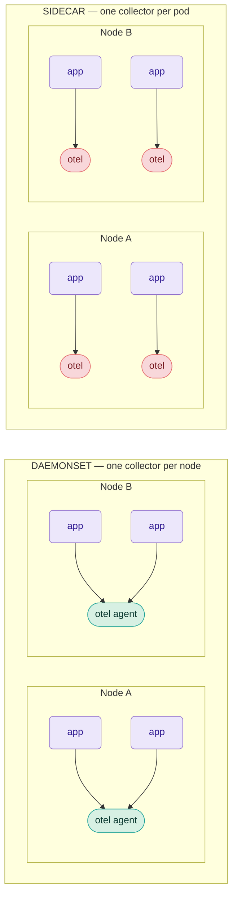
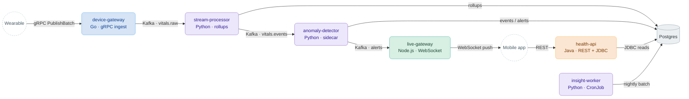
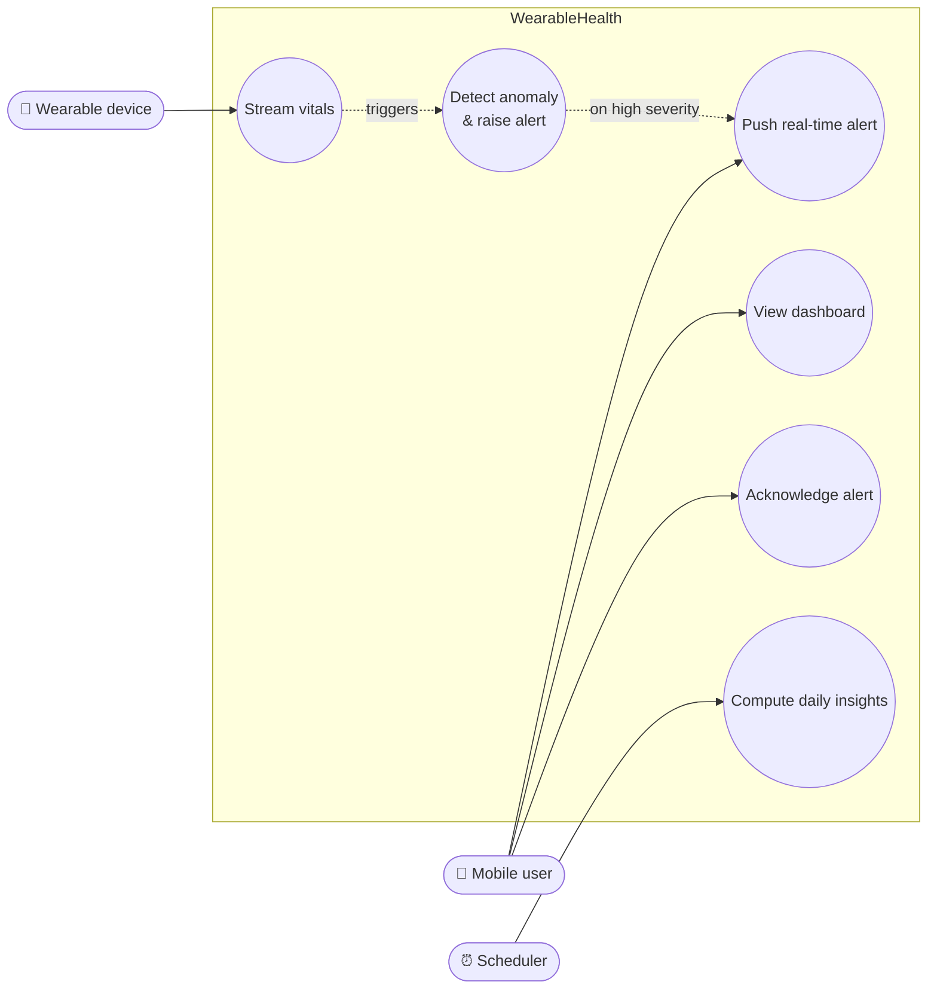
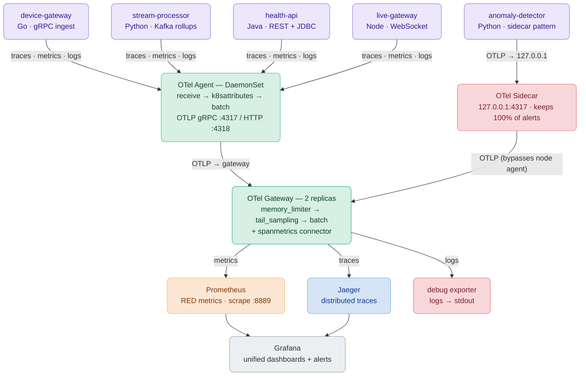
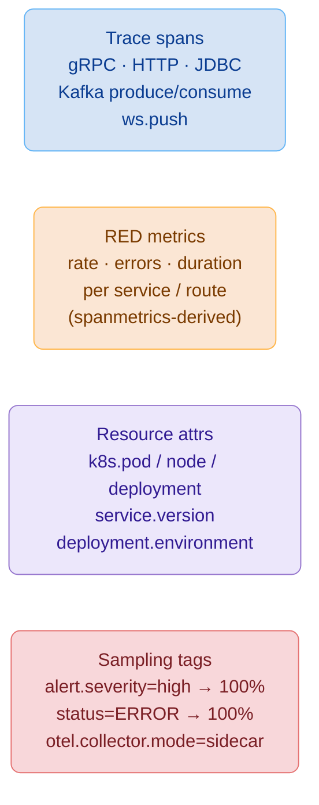
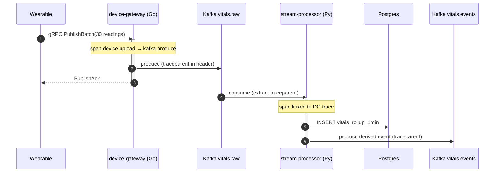
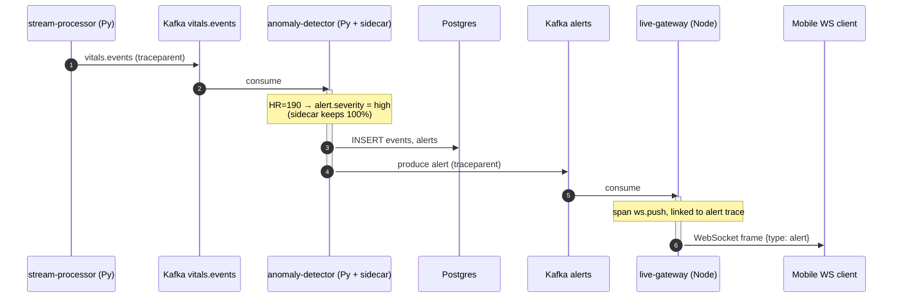
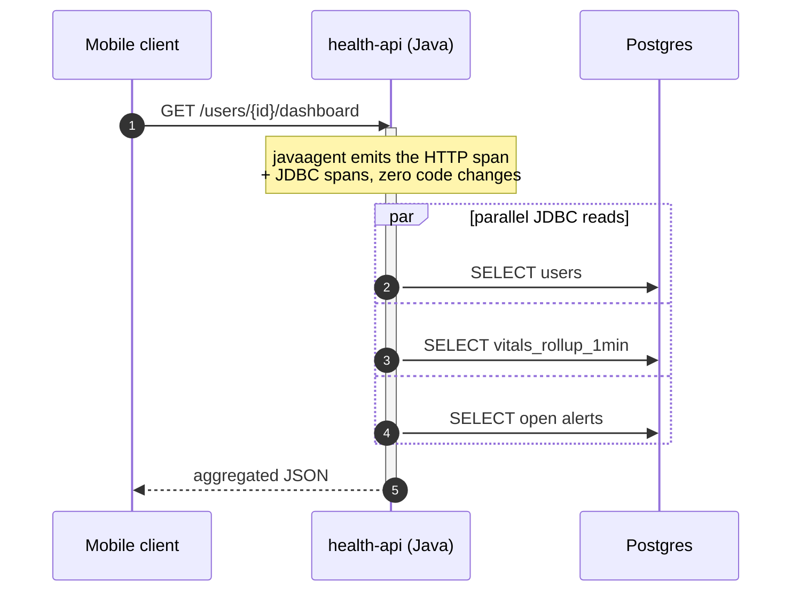
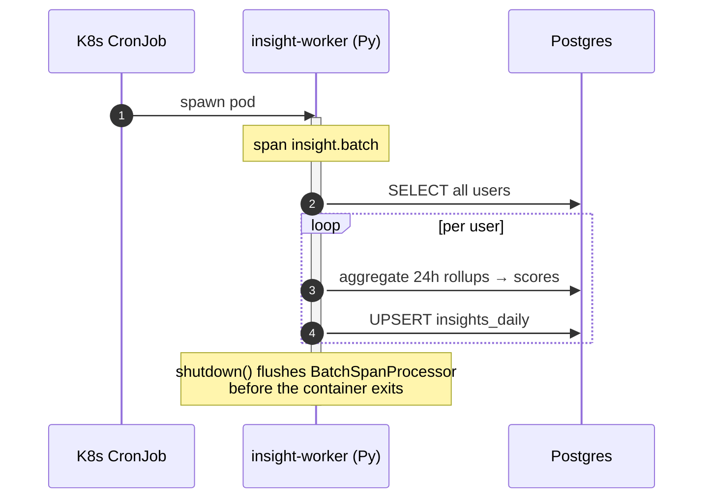

# One Trace, Four Languages: Proving the OpenTelemetry DaemonSet Pattern with a Polyglot Health Platform

*A complete, runnable proof-of-concept that ships traces across Go, Python, Java, and Node.js — and settles the “sidecar vs. DaemonSet” argument with real manifests, real configs, and a real trace you can watch end to end.*

---

## TL;DR

**WearableHealth** is a 7-service health-telemetry demo in 4 languages, wired together over gRPC, REST, Kafka, Postgres, WebSocket, and a CronJob. Every service emits OpenTelemetry traces and metrics into a centralized Jaeger + Prometheus + Grafana stack, all running on a local 3-node **K3d** cluster.

The point of the POC is not the app. It’s to **prove a deployment topology**: that you can collect telemetry from an entire polyglot fleet using **one OTel Collector per node (a DaemonSet “agent”) plus a central Gateway** — and that this beats the instinct to bolt a sidecar collector onto every pod. We run *both* patterns side by side in the same cluster so you can diff two YAML files and see exactly what changes.

Spin it up with one command on macOS, Linux, or Windows/WSL2:

```bash
make all
```

---

## First, the argument: Sidecar vs. DaemonSet

“Run the OTel agent as a sidecar” sounds like one pattern. It’s actually a choice between three topologies, and the choice has real cost and reliability consequences.

| Topology | Where it runs | Count in a 600-pod / 50-node cluster |
|---|---|---|
| **Sidecar** | An extra container inside *every* app pod | **600** collectors |
| **Agent (DaemonSet)** | One collector pod *per node* | **50** collectors |
| **Gateway** | A normal Deployment, replicated | a handful |



*4 pods → 4 collectors on the left; 4 pods → 2 collectors on the right. That ratio is the whole argument.*

### The trade-off table

| Dimension | Sidecar | Agent (DaemonSet) |
|---|---|---|
| Collectors at 600 pods | 600 | ~50 |
| Memory overhead **per app pod** | +80–150 MB | 0 |
| Per-app config flexibility | Excellent | Uniform per node |
| Failure blast radius | One pod | All pods on a node |
| App → collector hop | `127.0.0.1:4317` (no network) | `$(NODE_IP):4317` (downward API) |
| Rolling collector upgrade | Touches every workload | Touches one DaemonSet |
| Resource utilization | Many idle collectors | One busy collector per node |
| OTel’s own name for it | “sidecar” | **“agent”** (the canonical term) |

### The cost math, at realistic scale

For **50 nodes / 600 pods**:

- **Sidecar:** 600 collectors × ~100 MB / ~50 mCPU ≈ **60 GB RAM, 30 cores** reserved.
- **DaemonSet:** 50 collectors × ~250 MB / ~250 mCPU ≈ **12.5 GB RAM, 12.5 cores**.

That’s **~4.8× less memory** and **~2.4× less CPU** — and the gap widens with scale, because DaemonSet count grows with *nodes*, not *pods*.

### When the sidecar still wins

Sidecars aren’t obsolete. Reach for one when you can name the constraint:

1. **Per-app sampling policy** — e.g. a compliance-critical service that must keep **100%** of its traces regardless of the cluster-wide sampling rate.
2. **Strict tenant isolation** — one tenant’s telemetry must never share a buffer with another’s.
3. **A chatty, high-cardinality service** that would otherwise monopolize a shared node agent.

### What this POC actually does

A **deliberate hybrid**:

- **6 of 7 services** use the DaemonSet agent — the default, cost-efficient path.
- **1 service — `anomaly-detector`** — runs a sidecar collector, *specifically* to demonstrate constraint #1: it force-keeps 100% of alert spans so they survive the gateway’s tail sampling.

Same cluster, both patterns, one `diff` apart.

---

## Prerequisites — what you need

The whole stack runs locally on **K3d** (K3s-in-Docker), so a laptop is enough.

**Common to every OS:**

- **Docker** running (Desktop on macOS/Windows, Engine on Linux)
- **~8 GB RAM** allocatable to Docker (6 GB floor), **4 CPU**, ~20 GB disk

**Per OS — handled for you:** `make prereqs` **auto-detects the OS** via `uname -s` and installs the three CLIs it needs:

| OS | How `make prereqs` installs k3d / kubectl / helm |
|---|---|
| **macOS** | `brew install …` (Homebrew required) |
| **Linux** | each tool’s official cross-OS install script — *no* apt/dnf/pacman branching, so Ubuntu, Fedora, Arch all work identically (kubectl drops into `/usr/local/bin` via `sudo`) |
| **Windows** | run inside **WSL2** — it *is* Linux as far as the demo is concerned. (A Makefile needs a bash shell, so there’s no native-cmd path.) |

That’s the only OS-specific surface. Everything downstream — image builds, manifests, the cluster — is identical across platforms. The Makefile’s `DOCKER_PLATFORM` is derived from `uname -m`, so Apple Silicon (arm64) and Intel/Linux (amd64) both build matching single-platform images.

---

## Technologies used

| Layer | Tech | Role in the POC |
|---|---|---|
| **Orchestration** | K3d / K3s | 3-node Kubernetes cluster inside Docker |
| **Telemetry SDKs** | OpenTelemetry (Go, Python, Java javaagent, Node SDK) | Generate spans/metrics in each service |
| **Collection** | OTel Collector Contrib `0.105.0` | Agent (DaemonSet), Gateway, and one Sidecar |
| **Tracing backend** | Jaeger | Trace storage + waterfall UI |
| **Metrics backend** | Prometheus | Scrapes RED metrics from the gateway |
| **Dashboards** | Grafana | Visualizes the span-derived metrics |
| **Messaging** | Kafka (KRaft mode) | `vitals.raw` → `vitals.events` → `alerts` |
| **Database** | Postgres | Rollups, alerts, insights |
| **Languages** | Go, Python, Java/Spring Boot, Node.js/Fastify | The 7 services |
| **Build/Run** | Docker buildx, Make | One-command reproducible setup |

The seven services:

- **device-gateway** (Go) — gRPC ingest, Kafka producer
- **stream-processor** (Python) — Kafka in/out, Postgres rollups
- **anomaly-detector** (Python, **sidecar**) — rule-based detection, alert producer
- **health-api** (Java/Spring Boot) — REST + JDBC reads
- **live-gateway** (Node.js/Fastify) — Kafka consumer → WebSocket push
- **insight-worker** (Python, CronJob) — nightly batch scoring
- **loadgen** (Go) — simulated wearables (continuous loop **+** an on-demand `/simulate` HTTP endpoint)

---

## High-level architecture

The domain is a continuous health-telemetry platform à la Fitbit/Whoop: wearables push vitals → derived signals → anomaly detection → real-time alerts → dashboards and daily insights.



**Every solid arrow carries `traceparent` in its headers.** That’s what lets a single trace ID survive across four languages and across the Kafka producer/consumer boundary — with **zero correlation code in the apps**.

### Use cases

Three actors drive the platform; six use cases cover everything the services do.



---

## Low-level architecture — the observability plane



*Apps emit all three signals to their node-local **Agent** (or, for `anomaly-detector`, its **Sidecar**). The **Gateway** is the only place that knows about backends — tail-samples traces to Jaeger, derives RED metrics to Prometheus, and ships logs to a debug exporter. **Grafana** unifies the dashboards.*

#### What each service emits



There are three collector roles, each a distinct config. This is the heart of the POC, so here’s what each one actually does.

### 1. The Agent (DaemonSet) — one per node

Apps send OTLP to their **node-local** agent at `$(NODE_IP):4317`, where `NODE_IP` is injected by the Kubernetes **downward API**:

```yaml
- name: NODE_IP
  valueFrom:
    fieldRef:
      fieldPath: status.hostIP
- name: OTEL_EXPORTER_OTLP_ENDPOINT
  value: "$(NODE_IP):4317"
```

The agent enriches and forwards. Its pipeline (`otel-config/agent-collector.yaml`):

- **`k8sattributes`** — tags every span with `k8s.namespace.name`, `k8s.pod.name`, `k8s.node.name`, `k8s.deployment.name`, plus `service.version` from a pod label. It needs a `ClusterRole` to `get/list/watch` pods, namespaces, and nodes.
- **`resource`** — stamps `deployment.environment=local-k3d`.
- **`batch` + `memory_limiter`** — backpressure safety.
- Exports to the gateway with a **persistent sending queue + retry** (`queue_size: 1000`, exponential backoff to 30s) so a brief gateway blip doesn’t drop spans.

### 2. The Gateway — central, 2 replicas

This is where the heavy, stateful processing lives (`otel-config/gateway-collector.yaml`).

**Tail sampling** — decisions made *after* a full trace is assembled (`decision_wait: 10s`):

| Policy | Type | Keeps |
|---|---|---|
| errors | `status_code: [ERROR]` | **100%** |
| alert-spans | `string_attribute alert.severity ∈ {high, critical}` | **100%** |
| slow-traces | `latency > 1000ms` | **100%** |
| baseline | `probabilistic 10%` | 10% of everything else |

**`spanmetrics` connector** — derives **RED metrics** (rate / errors / duration) from spans, with dimensions `http.method`, `http.status_code`, `rpc.system`, `messaging.system`, `messaging.destination.name`, and an explicit-bucket latency histogram. Those metrics flow into a second pipeline that exports to Prometheus — **no application metric code anywhere.**

**Exports:** traces → Jaeger (`otlp/jaeger`), metrics → Prometheus (`:8889`).

### 3. The Sidecar — the deliberate exception

`anomaly-detector` runs **two containers in one pod**: the app and an `otel/opentelemetry-collector-contrib` sidecar. The app exports to `127.0.0.1:4317` instead of `$(NODE_IP)`:

```yaml
- name: OTEL_EXPORTER_OTLP_ENDPOINT
  value: "127.0.0.1:4317"   # ← the sidecar, not the node agent
```

The sidecar (`otel-config/sidecar-collector.yaml`) stamps `otel.collector.mode=sidecar` and sends **straight to the gateway**, bypassing the node agent. Because alert spans already carry `alert.severity=high`, the gateway’s tail sampler keeps 100% of them — the sidecar’s job here is to give that service a private, lower-latency (`timeout: 1s`) export path and a clean place to enforce per-app policy.

### The whole path, in one line

```
app SDK ──OTLP──► [agent @ NODE_IP:4317  |  sidecar @ 127.0.0.1:4317]
        ──OTLP──► gateway (tail-sample + spanmetrics) ──► Jaeger + Prometheus ──► Grafana
```

**Apps never name a backend.** Swapping Jaeger for Grafana Tempo is a one-block edit in the gateway config; not a single service redeploys.

---

## Sequence diagrams — the traced flows

Each flow below produces one connected trace in Jaeger. Note where `traceparent` is injected/extracted — that’s the only “glue” and it’s the reason the trace doesn’t shatter at each hop.

### Flow 1 · Vitals ingestion (the hot path)



### Flow 2 · Anomaly alert — the showcase (4 languages, 1 trace)



> The gateway’s tail-sampling policy keeps **100%** of any trace containing `alert.severity ∈ {high, critical}`, while routine traffic is sampled at 10%. Every alert stays fully visible; volume stays bounded.

### Flow 3 · User dashboard query (read-heavy, Java auto-instrumented)



### Flow 4 · Scheduled batch (CronJob, explicit flush)



---

## How to run the example

From a fresh checkout:

```bash
make prereqs     # auto-detects OS, installs k3d/kubectl/helm
make all         # cluster + infra + observability + build 7 images + deploy (~8 min first run)
make ps          # confirm pods Running across infra / observability / wearable
```

Open the UIs (or `make portforward` if the ports are taken):

```
http://localhost:3000     # Grafana   (admin/admin)
http://localhost:16686    # Jaeger
http://localhost:9090     # Prometheus
```

### Generate load — two modes

**Continuous loop.** `loadgen` mints `DEVICE_COUNT` (default 3) simulated wearables, each with **random v4 UUIDs**, and pushes a 30-reading batch every 5s. Every 20th batch is deliberately anomalous (heart rate 190+) to trip the tachycardia rule.

```bash
make simulate          # start the loop
make simulate-logs     # watch: "device 3f2a… → user 9c11…" then accepted=30 lines
```

**On-demand, one trace at a time.** `loadgen` also serves `POST /simulate`, which publishes exactly one batch and returns the `trace_id` so you can jump straight to it in Jaeger:

```bash
make simulate-once               # forces an anomalous batch (ANOM=true)
make simulate-once ANOM=false    # a normal batch

# or hit it directly:
make pf-loadgen                  # → localhost:8080
curl -XPOST "localhost:8080/simulate?anomalous=true"
curl -XPOST "localhost:8080/simulate?device_id=$(uuidgen)&user_id=$(uuidgen)"
```

```json
{"device_id":"…","user_id":"…","anomalous":true,"accepted":30,"rejected":0,"trace_id":"4bf92f3577b34da6…"}
```

Loop-driven spans are tagged `trigger=loop`; on-demand ones `trigger=manual` — so you can isolate exactly the trace you just fired.

---

## What we gained

### Polyglot tracing that actually correlates

This is **Flow 2** above, as it lands in Jaeger — one waterfall, top to bottom: `loadgen (Go)` → `device-gateway (Go)` → `stream-processor (Py)` → `anomaly-detector (Py)` → `live-gateway (Node)`.

```mermaid
gantt
    title One trace, four languages (Jaeger waterfall)
    dateFormat  x
    axisFormat  %Lms
    section loadgen · Go
    device.upload (root)        :a1, 0, 1420
    section device-gateway · Go
    PublishBatch + kafka.produce:a2, 40, 180
    section stream-processor · Py
    consume + Postgres + produce:a3, 260, 300
    section anomaly-detector · Py
    evaluate → alert.severity=high :crit, a4, 620, 360
    section live-gateway · Node
    kafka.consume + ws.push     :a5, 1040, 300
```



Each section is a different language; the bars overlap exactly where the spans nest. The trace stays connected across every **Kafka boundary** because each producer injects `traceparent` and each consumer extracts it. Four languages, one trace ID, **0 lines of correlation code in any app.**

Per-language instrumentation styles, all interoperating:

- **Go** — `go.opentelemetry.io/otel` with gRPC stats handlers + manual Kafka header injection.
- **Python** — `opentelemetry-sdk` with `asyncpg` auto-instrumentation + manual Kafka context propagation.
- **Java** — the `opentelemetry-javaagent.jar` attaches at startup: JDBC, Tomcat, HTTP client spans for **free**, no code changes.
- **Node.js** — `@opentelemetry/sdk-node` via `node --require ./tracing.cjs` so auto-instrumentation loads before any import.

### Sampling that keeps what matters

Every error, every alert, and everything slow is kept at 100%; the boring 90% is dropped at 10% baseline. Volume stays sane *and* no incident is ever invisible.

### RED metrics for free

The `spanmetrics` connector turns spans into Prometheus rate/error/duration metrics, rendered in Grafana — without a single line of metrics code in the services.

### One-command reproducibility, any OS

`make all` runs prereqs → cluster-up → infra-up → obs-up → build-all → load-all → deploy-apps with rollout verification at every step. On failure it prints the exact `kubectl describe`/`logs` command to debug. Same command on macOS, Linux, and WSL2.

---

## Proving it works with the DaemonSet

A claim isn’t a proof. Here’s how to verify, from the cluster itself, that a node-local DaemonSet agent collects the whole polyglot fleet — and how to see the sidecar exception behaving differently.

### 1. There is exactly one agent per node

```bash
kubectl -n observability get daemonset otel-agent
kubectl -n observability get pods -l app=otel-agent -o wide   # one pod, one per node
kubectl get nodes
```

The agent pod count equals the node count — not the app-pod count. That *is* the DaemonSet economy, observable directly.

### 2. The two patterns differ by one env var

```bash
# DaemonSet path — app talks to the node IP via downward API:
grep -A2 OTEL_EXPORTER_OTLP_ENDPOINT k8s/apps/device-gateway.yaml
#   value: "$(NODE_IP):4317"

# Sidecar path — same app-level wiring, pointed at localhost + a 2nd container:
grep -A2 OTEL_EXPORTER_OTLP_ENDPOINT k8s/apps/anomaly-detector.yaml
#   value: "127.0.0.1:4317"
kubectl -n wearable get pod -l app=anomaly-detector \
  -o jsonpath='{.items[0].spec.containers[*].name}'   # → anomaly-detector otel-sidecar
```

Six services point at `$(NODE_IP)`; one points at `127.0.0.1` and carries a second container. That’s the entire difference.

### 3. Telemetry actually flows through the agent

```bash
make otel-agent-logs      # node DaemonSet — should show batches received/forwarded
make otel-gateway-logs    # central gateway — receiving from agents AND the sidecar
```

### 4. The end-to-end trace exists across four languages

```bash
make simulate-once ANOM=true     # fire one anomalous batch, note the trace_id
```

Open Jaeger → *Search by Trace ID* with the returned `trace_id`. You should see five services and four languages on one waterfall, with the `anomaly-detector` span carrying `alert.severity=high`. Filter spans by `trigger=manual` to find only your shot.

### 5. The sidecar leaves a fingerprint

Spans from `anomaly-detector` carry `otel.collector.mode=sidecar` (stamped by the sidecar’s `resource` processor); everything routed through the node agent does not. Search/group by that attribute in Jaeger and you’re looking at the two collection paths, distinguished in the data itself.

### 6. Metrics prove the connector ran

In Prometheus (`:9090`), query the span-derived series — e.g. `calls_total` / the duration histogram by `service.name`. Non-empty results mean spans reached the gateway, the `spanmetrics` connector fired, and Prometheus scraped it — the full pipeline, proven from the metrics side.

If all six checks pass, the topology is doing exactly what the diagram claims: **one collector per node, plus a central gateway, collecting an entire 4-language fleet — with a single sidecar exception that’s visible in both the manifests and the telemetry.**

---

## Where to go next

- **mTLS + signed OTLP exports** — everything here is plaintext.
- **Grafana Tempo / full LGTM stack** instead of Jaeger all-in-one.
- **Multi-cluster gateway federation** across regions.
- **A real model** in `anomaly-detector`, with inference latency as span events.

But the takeaway stands on its own:

> **OTel deployment topology is an architectural decision, not a config detail.** Sidecars feel right because service meshes trained us to think that way. For telemetry, default to **DaemonSet agent + Gateway**, and reach for a sidecar only when you can name the constraint it solves — exactly as `anomaly-detector` does here.

The full source — manifests, configs, Makefile, and these diagrams — is in the repo. Clone it and run `make all`.

---

*Tags: opentelemetry, kubernetes, observability, microservices, golang, python, java, nodejs*
